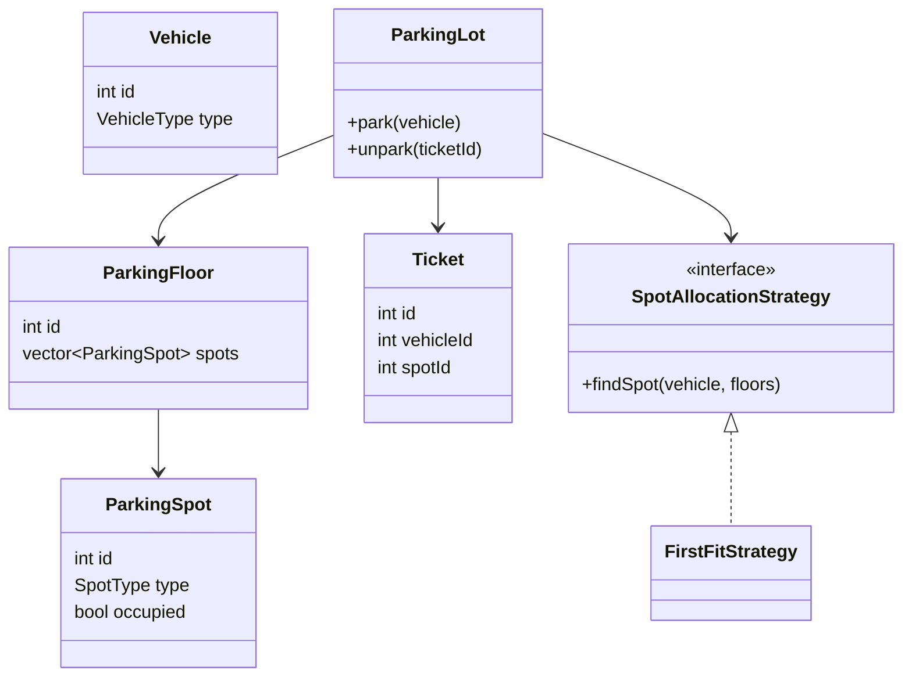

# C++ LLD + Machine Coding — Canonical Handbook

**Purpose:** Build one stable mental model for the most reusable SDE-1 / fresher LLD and machine-coding designs, then reuse those flows on unfamiliar problems.

**Language:** C++17  
**Style:** Interview-first, simple, single-file, runnable, readable  
**Mode:** This handbook is the reference solution set for the first learning phase. After internalizing it, new problems should switch to interviewer mode: you design first, I challenge you, and hints are progressive.

---

## 0. Why this handbook exists

A common failure mode when using AI for LLD is getting a different architecture every time:

```text
BookMyShow v1
Movie -> Theatre -> Screen -> Show -> Seat -> Booking

BookMyShow v2
Movie -> Venue -> Auditorium -> ShowTime -> Inventory -> Reservation

BookMyShow v3
MovieCatalog -> VenueService -> SeatInventory -> LockManager
              -> BookingService -> PaymentService -> Repository
```

All three can be defensible. That is precisely why they can be bad for learning at first.

The goal here is different:

> **Pick one simple canonical architecture, use it repeatedly, and learn why it works.**

Then new problems become recognition + adaptation rather than starting from an empty page.

---

# 1. The mental model to memorize

Most interview LLD problems reduce to a small number of recurring flows.

## Flow A — Allocation

```text
Request
   |
   v
Find suitable resource
   |
   v
Allocate resource
   |
   v
Return ticket / assignment
```

Examples:

- Parking spot
- Delivery partner
- Elevator car
- Storage locker
- Available machine

Typical pattern: **Strategy** when “suitable resource” has multiple legitimate algorithms.

---

## Flow B — Reservation / locking

```text
AVAILABLE
    |
    v
HELD / LOCKED
    |
    v
CONFIRMED
```

Failure paths:

```text
HELD --payment failure--> AVAILABLE
HELD --timeout----------> AVAILABLE
```

Examples:

- BookMyShow seat
- Hotel room
- Flight seat
- Appointment slot
- Concert ticket

The critical rule:

> **Check and modify the shared resource in one atomic critical section.**

For an interview single-process implementation, that usually means one `mutex` + `lock_guard` around check-then-act. Production may move the ownership of the lock into a database or distributed lock service.

---

## Flow C — Order / transaction lifecycle

```text
CREATED
   |
   v
PAYMENT
   |
   v
CONFIRMED
   |
   v
FULFILLED
```

Typical failure path:

```text
PAYMENT_FAILED -> cancel / release inventory
```

Examples:

- E-commerce
- Food ordering
- Ticket booking
- Subscription purchase

Typical pattern: **State** once different operations are legal in different states.

---

## Flow D — Variable algorithm

```text
Context
   |
   +---- Strategy A
   +---- Strategy B
   +---- Strategy C
```

Use it when the requirement genuinely says:

> “The same thing can be done using different algorithms/rules.”

Examples:

- Parking allocation
- Pricing
- Expense splitting
- Rate limiting algorithm
- Payment routing

This is the most reusable pattern in this handbook.

---

## Flow E — Notify interested parties

```text
Subject
   |
   +--> Display
   +--> Notification
   +--> Audit
   +--> Analytics
```

Use **Observer** when the publisher should not know the concrete set of listeners.

Examples:

- Order status changes
- Seat availability display
- Payment status webhook
- Elevator floor display

---

## Flow F — Integrate incompatible external APIs

```text
Your interface
      |
  +---+---+
  |       |
Adapter A Adapter B
  |       |
Provider  Provider
```

Use **Adapter** when external implementations have incompatible APIs but your domain wants one common interface.

Examples:

- Stripe / Razorpay / PayPal-like providers
- Bank / UPI / card processors
- Maps providers
- Notification providers

---

## Flow G — Validate through sequential checks

```text
Auth
  |
  v
Fraud check
  |
  v
Limit check
  |
  v
Business check
  |
  v
Process
```

Use **Chain of Responsibility** when independent checks can be inserted/reordered and a failure stops the pipeline.

Excellent fintech pattern.

---

# 2. The canonical problem set

These are the systems worth deeply internalizing first.

| # | Problem | Primary mental model | Important patterns | Why it matters |
|---|---|---|---|---|
| 1 | Parking Lot | Allocation | Strategy | Fundamental OOD warm-up |
| 2 | BookMyShow | Reservation + concurrency | State/Strategy/Observer/Adapter extensions | Shared inventory under contention |
| 3 | E-commerce | Order lifecycle | State/Strategy/Observer | Reusable transaction flow |
| 4 | Splitwise | Rules + ledger/balances | Strategy | Excellent fintech-adjacent modelling |
| 5 | Vending Machine | State machine | State | Textbook state design |
| 6 | Elevator | Scheduling + state | Strategy/State/Observer | Shows algorithm + OOD |
| 7 | Rate Limiter | Policy + concurrency | Strategy | Infrastructure + fintech relevance |
| 8 | Payment Gateway | Money-moving workflow | Adapter/Strategy/State/Chain/Observer | Core fintech design |
| 9 | Digital Wallet / Ledger | Monetary invariant | State + idempotency + ledger | Core fintech correctness |

Do not attempt to memorize 30 systems before these nine are comfortable.

---

# 3. One rule for all code in this handbook

The code is deliberately simpler than production, but every canonical design must still have a coherent core flow.

A reference implementation is considered complete for this handbook when it models the agreed interview scope end-to-end.
A separate `main()` test driver is added during our machine-coding sessions rather than bloating every handbook example.

We prefer:

```cpp
unordered_map<int, Entity>
unique_ptr<Strategy>
enum class
mutex
lock_guard<mutex>
bool / int / nullptr for expected failures
```

We deliberately avoid:

- DTO layers
- repository interfaces with one implementation
- factories that create one type
- dependency-injection containers
- configuration objects
- exceptions for ordinary business failures
- logging frameworks
- distributed infrastructure inside a machine-coding solution

The handbook will mention production upgrades separately rather than smuggling them into the canonical implementation.

---

# 4. Design 1 — Parking Lot

## 4.1 Domain

A parking lot has floors. Floors have parking spots. A vehicle enters, receives a suitable spot, gets a ticket, and exits later.

Canonical relationship:

```text
ParkingLot
   |
   +---- ParkingFloor
            |
            +---- ParkingSpot

Vehicle ----> Ticket ----> ParkingSpot
```

## 4.2 Core use case

```text
park(vehicle)
    -> find a compatible free spot
    -> mark it occupied
    -> return ticket

unpark(ticket)
    -> calculate fee
    -> mark spot free
```

## 4.3 What should be an object?

```text
Vehicle       = data
ParkingSpot   = data + small resource state
Ticket        = booking/assignment record
ParkingFloor  = collection owner
ParkingLot    = orchestration + policy owner
```

The lot should not know every detail of pricing or allocation if those rules are expected to change independently.

## 4.4 Strategy appears naturally

Two valid allocation rules:

```text
FirstFreeSpot
NearestSpot
```

Same operation:

```cpp
findSpot(vehicle)
```

Different algorithm.

That is a genuine Strategy use case.

## 4.5 Canonical class model



## 4.6 Reference C++

```cpp
#include <iostream>
#include <string>
#include <vector>
#include <unordered_map>
#include <memory>
#include <mutex>
#include <utility>

using namespace std;

enum class VehicleType { Bike, Car, Truck };
enum class SpotType { Bike, Compact, Large };

struct Vehicle {
    int id;
    VehicleType type;
};

struct ParkingSpot {
    int id;
    SpotType type;
    bool occupied = false;
};

struct ParkingFloor {
    int id;
    vector<ParkingSpot> spots;
};

struct Ticket {
    int id;
    int vehicleId;
    int floorId;
    int spotId;
};

bool fits(VehicleType vehicle, SpotType spot) {
    if (vehicle == VehicleType::Bike) return true;
    if (vehicle == VehicleType::Car) return spot != SpotType::Bike;
    return spot == SpotType::Large;
}

class SpotAllocationStrategy {
public:
    virtual pair<int, int> findSpot(VehicleType type,
                                    vector<ParkingFloor>& floors) = 0;
    virtual ~SpotAllocationStrategy() = default;
};

class FirstFitStrategy : public SpotAllocationStrategy {
public:
    pair<int, int> findSpot(VehicleType type,
                            vector<ParkingFloor>& floors) override {
        for (auto& floor : floors) {
            for (auto& spot : floor.spots) {
                if (!spot.occupied && fits(type, spot.type))
                    return {floor.id, spot.id};
            }
        }
        return {-1, -1};
    }
};

class ParkingLot {
public:
    ParkingLot(unique_ptr<SpotAllocationStrategy> strategy)
        : strategy_(move(strategy)) {}

    int addFloor() {
        int id = nextFloorId_++;
        floors_.push_back({id, {}});
        return id;
    }

    int addSpot(int floorId, SpotType type) {
        for (auto& floor : floors_) {
            if (floor.id == floorId) {
                int id = nextSpotId_++;
                floor.spots.push_back({id, type, false});
                return id;
            }
        }
        return -1;
    }

    int park(const Vehicle& vehicle) {
        lock_guard<mutex> lock(mtx_); // guards floor/spot allocation + tickets

        auto [floorId, spotId] = strategy_->findSpot(vehicle.type, floors_);
        if (floorId == -1) {
            cout << "No suitable spot available\n";
            return -1;
        }

        for (auto& floor : floors_) {
            if (floor.id != floorId) continue;
            for (auto& spot : floor.spots) {
                if (spot.id == spotId) {
                    spot.occupied = true;
                    break;
                }
            }
        }

        int ticketId = nextTicketId_++;
        tickets_[ticketId] = {ticketId, vehicle.id, floorId, spotId};
        return ticketId;
    }

    bool unpark(int ticketId) {
        lock_guard<mutex> lock(mtx_);

        auto it = tickets_.find(ticketId);
        if (it == tickets_.end()) {
            cout << "Ticket not found\n";
            return false;
        }

        for (auto& floor : floors_) {
            if (floor.id != it->second.floorId) continue;
            for (auto& spot : floor.spots) {
                if (spot.id == it->second.spotId) {
                    spot.occupied = false;
                    break;
                }
            }
        }

        tickets_.erase(it);
        return true;
    }

private:
    vector<ParkingFloor> floors_;
    unordered_map<int, Ticket> tickets_;
    unique_ptr<SpotAllocationStrategy> strategy_;
    int nextFloorId_ = 1;
    int nextSpotId_ = 1;
    int nextTicketId_ = 1;
    mutex mtx_;
};
```

## 4.7 Reasoning questions to memorize

1. Who owns the spots?
2. Why should `ParkingLot` own `ParkingSpot` objects rather than each spot owning itself somewhere else?
3. What part is likely to change independently?
4. Why does Strategy belong around allocation rather than around `ParkingSpot`?
5. What must happen inside one lock?

## 4.8 Follow-ups

**Pricing:** add `PricingStrategy`.

```text
FlatHourlyPricing
ProgressivePricing
WeekendPricing
```

**Payment:** add `PaymentMethod` only if payment behaviour itself matters.

**Display board:** Observer is a reasonable extension because availability changes can notify displays.

**Production:** keep availability indexed instead of scanning every spot; persistent ticket state and DB transactions would be needed for multi-server correctness.

## 4.9 Transfer analogy

Parking Lot is really:

> **Request -> find compatible resource -> reserve resource -> release resource.**

That mental model transfers to:

- hotel rooms
- lockers
- charging stations
- compute workers
- delivery partners

---

# 5. Design 2 — BookMyShow

This is the key reservation design.

## 5.1 Domain model

```text
City
  |
  +--> Theatre
          |
          +--> Screen
                  |
                  +--> Show
                         |
                         +--> ShowSeat state

Movie ---------> Show
User ----------> Booking
Booking -------> Payment
```

Important:

> A physical seat belongs to a screen, but its **availability is specific to a show**.

So A1 being booked for the 7 PM show does not make A1 unavailable for the 10 PM show.

## 5.2 Core flow

```text
Search movie
    |
    v
Find shows
    |
    v
Select show
    |
    v
Select seats
    |
    v
Hold seats
    |
    v
Payment
  /   \
fail   success
 |        |
release  confirm
```

## 5.3 The critical invariant

For a particular show and seat:

```text
At most one user can successfully move it into Booked.
```

That means this is wrong:

```cpp
if (seat.available) {       // thread A
    // thread B can enter here
    seat.available = false;
}
```

The check and mutation must happen under one lock.

## 5.4 TTL holds

Canonical interview simplification:

```text
AVAILABLE -> HELD(user, expiry)
```

If the hold expires:

```text
HELD + now >= expiry -> AVAILABLE
```

Production can use a distributed store such as Redis. Redis documents an `SET key value NX EX seconds` pattern for a lock with automatic expiry; real distributed locking requires stronger discussion than simply dropping a mutex into the system.

## 5.5 Reference C++

This version models the important domain hierarchy **and** separates the external payment call from the seat-state lock.

```cpp
#include <iostream>
#include <string>
#include <vector>
#include <unordered_map>
#include <memory>
#include <mutex>
#include <chrono>

using namespace std;
using Cents = long long;
using Clock = chrono::steady_clock;

struct Movie {
    int id;
    string name;
};

struct Theatre {
    int id;
    string name;
};

struct Seat {
    int id;
    string label;
};

struct Screen {
    int id;
    int theatreId;
    vector<Seat> seats;
};

enum class SeatState { Available, Held, PaymentPending, Booked };
enum class BookingState { Held, PaymentPending, Confirmed, Failed };

struct ShowSeat {
    Seat seat;
    SeatState state = SeatState::Available;
    string heldBy;
    Clock::time_point heldUntil;
};

struct Show {
    int id;
    int movieId;
    int theatreId;
    int screenId;
    string startTime;
    unordered_map<int, ShowSeat> seats;
};

struct Booking {
    int id;
    string userId;
    int showId;
    vector<int> seatIds;
    BookingState state = BookingState::Held;
};

struct ShowSummary {
    int showId;
    int theatreId;
    int screenId;
    string startTime;
};

class PaymentGateway {
public:
    bool pay(const string& userId, Cents amount) {
        cout << "Payment requested for " << userId << " : " << amount << "\n";
        return true;
    }
};

class BookingService {
public:
    BookingService(PaymentGateway* payment) : payment_(payment) {}

    void addMovie(const Movie& movie) {
        movies_[movie.id] = movie;
    }

    void addTheatre(const Theatre& theatre) {
        theatres_[theatre.id] = theatre;
    }

    void addScreen(const Screen& screen) {
        screens_[screen.id] = screen;
    }

    int createShow(int movieId, int theatreId, int screenId,
                   const string& startTime) {
        if (!movies_.count(movieId) || !theatres_.count(theatreId)) return -1;

        auto screenIt = screens_.find(screenId);
        if (screenIt == screens_.end()) return -1;
        if (screenIt->second.theatreId != theatreId) return -1;

        Show show{nextShowId_++, movieId, theatreId, screenId, startTime, {}};
        for (const auto& seat : screenIt->second.seats)
            show.seats[seat.id] = {seat};

        shows_[show.id] = show;
        return show.id;
    }

    vector<Movie> searchMovies(const string& query) const {
        vector<Movie> result;
        for (const auto& [id, movie] : movies_) {
            if (movie.name.find(query) != string::npos)
                result.push_back(movie);
        }
        return result;
    }

    vector<ShowSummary> getShows(int movieId) const {
        vector<ShowSummary> result;
        for (const auto& [id, show] : shows_) {
            if (show.movieId == movieId)
                result.push_back({show.id, show.theatreId, show.screenId, show.startTime});
        }
        return result;
    }

    int createBooking(int showId, const string& userId,
                      const vector<int>& seatIds) {
        lock_guard<mutex> lock(mtx_); // guards seat state + bookings

        auto showIt = shows_.find(showId);
        if (showIt == shows_.end()) return -1;

        auto& show = showIt->second;
        auto now = Clock::now();
        if (seatIds.empty()) return -1;

        unordered_map<int, bool> requested;

        // Check everything before changing anything: no partial holds.
        for (int seatId : seatIds) {
            if (requested[seatId]) return -1;
            requested[seatId] = true;

            auto it = show.seats.find(seatId);
            if (it == show.seats.end()) return -1;

            auto& seat = it->second;
            if (seat.state == SeatState::Held && now >= seat.heldUntil) {
                seat.state = SeatState::Available;
                seat.heldBy.clear();
            }

            if (seat.state != SeatState::Available) return -1;
        }

        auto expiry = now + chrono::minutes(5);
        for (int seatId : seatIds) {
            auto& seat = show.seats[seatId];
            seat.state = SeatState::Held;
            seat.heldBy = userId;
            seat.heldUntil = expiry;
        }

        int bookingId = nextBookingId_++;
        bookings_[bookingId] = {bookingId, userId, showId, seatIds,
                                BookingState::Held};
        return bookingId;
    }

    bool payAndConfirm(int bookingId, Cents amount) {
        string userId;

        {
            lock_guard<mutex> lock(mtx_);

            auto bookingIt = bookings_.find(bookingId);
            if (bookingIt == bookings_.end()) return false;
            if (bookingIt->second.state != BookingState::Held) return false;

            auto showIt = shows_.find(bookingIt->second.showId);
            if (showIt == shows_.end()) return false;

            auto& show = showIt->second;
            auto now = Clock::now();
            for (int seatId : bookingIt->second.seatIds) {
                auto& seat = show.seats[seatId];
                if (seat.state != SeatState::Held ||
                    seat.heldBy != bookingIt->second.userId ||
                    now >= seat.heldUntil) {
                    bookingIt->second.state = BookingState::Failed;
                    return false;
                }
            }

            // Prevent another user from acquiring these seats while payment runs.
            for (int seatId : bookingIt->second.seatIds)
                show.seats[seatId].state = SeatState::PaymentPending;

            bookingIt->second.state = BookingState::PaymentPending;
            userId = bookingIt->second.userId;
        }

        // External call happens outside our application lock.
        bool paid = payment_->pay(userId, amount);

        lock_guard<mutex> lock
