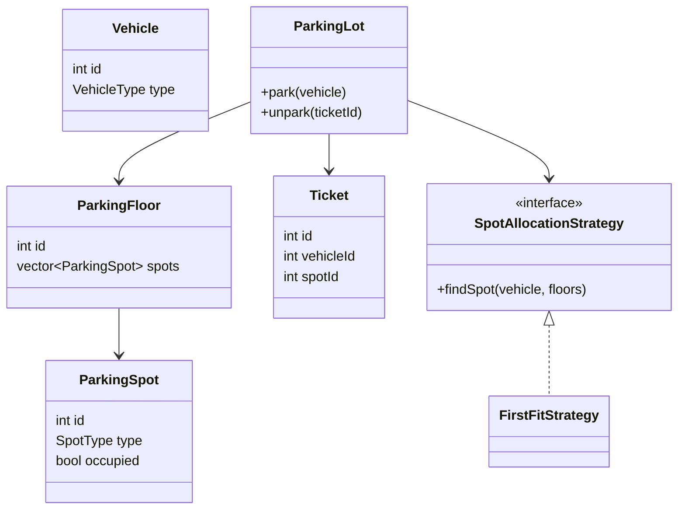

# C++ LLD + Machine Coding — Canonical Handbook

**Purpose:** Build one stable mental model for the most reusable SDE-1 / fresher LLD and machine-coding designs, then reuse those flows on unfamiliar problems.

**Language:** C++17  
**Style:** Interview-first, simple, single-file, runnable, readable  
**Mode:** This handbook is the reference solution set for the first learning phase. After internalizing it, new problems should switch to interviewer mode: you design first, I challenge you, and hints are progressive.

---

## 0. Why this handbook exists

A common failure mode when using AI for LLD is getting a different architecture every time:

```text
BookMyShow v1
Movie -> Theatre -> Screen -> Show -> Seat -> Booking

BookMyShow v2
Movie -> Venue -> Auditorium -> ShowTime -> Inventory -> Reservation

BookMyShow v3
MovieCatalog -> VenueService -> SeatInventory -> LockManager
              -> BookingService -> PaymentService -> Repository
```

All three can be defensible. That is precisely why they can be bad for learning at first.

The goal here is different:

> **Pick one simple canonical architecture, use it repeatedly, and learn why it works.**

Then new problems become recognition + adaptation rather than starting from an empty page.

---

# 1. The mental model to memorize

Most interview LLD problems reduce to a small number of recurring flows.

## Flow A — Allocation

```text
Request
   |
   v
Find suitable resource
   |
   v
Allocate resource
   |
   v
Return ticket / assignment
```

Examples:

- Parking spot
- Delivery partner
- Elevator car
- Storage locker
- Available machine

Typical pattern: **Strategy** when “suitable resource” has multiple legitimate algorithms.

---

## Flow B — Reservation / locking

```text
AVAILABLE
    |
    v
HELD / LOCKED
    |
    v
CONFIRMED
```

Failure paths:

```text
HELD --payment failure--> AVAILABLE
HELD --timeout----------> AVAILABLE
```

Examples:

- BookMyShow seat
- Hotel room
- Flight seat
- Appointment slot
- Concert ticket

The critical rule:

> **Check and modify the shared resource in one atomic critical section.**

For an interview single-process implementation, that usually means one `mutex` + `lock_guard` around check-then-act. Production may move the ownership of the lock into a database or distributed lock service.

---

## Flow C — Order / transaction lifecycle

```text
CREATED
   |
   v
PAYMENT
   |
   v
CONFIRMED
   |
   v
FULFILLED
```

Typical failure path:

```text
PAYMENT_FAILED -> cancel / release inventory
```

Examples:

- E-commerce
- Food ordering
- Ticket booking
- Subscription purchase

Typical pattern: **State** once different operations are legal in different states.

---

## Flow D — Variable algorithm

```text
Context
   |
   +---- Strategy A
   +---- Strategy B
   +---- Strategy C
```

Use it when the requirement genuinely says:

> “The same thing can be done using different algorithms/rules.”

Examples:

- Parking allocation
- Pricing
- Expense splitting
- Rate limiting algorithm
- Payment routing

This is the most reusable pattern in this handbook.

---

## Flow E — Notify interested parties

```text
Subject
   |
   +--> Display
   +--> Notification
   +--> Audit
   +--> Analytics
```

Use **Observer** when the publisher should not know the concrete set of listeners.

Examples:

- Order status changes
- Seat availability display
- Payment status webhook
- Elevator floor display

---

## Flow F — Integrate incompatible external APIs

```text
Your interface
      |
  +---+---+
  |       |
Adapter A Adapter B
  |       |
Provider  Provider
```

Use **Adapter** when external implementations have incompatible APIs but your domain wants one common interface.

Examples:

- Stripe / Razorpay / PayPal-like providers
- Bank / UPI / card processors
- Maps providers
- Notification providers

---

## Flow G — Validate through sequential checks

```text
Auth
  |
  v
Fraud check
  |
  v
Limit check
  |
  v
Business check
  |
  v
Process
```

Use **Chain of Responsibility** when independent checks can be inserted/reordered and a failure stops the pipeline.

Excellent fintech pattern.

---

# 2. The canonical problem set

These are the systems worth deeply internalizing first.

| # | Problem | Primary mental model | Important patterns | Why it matters |
|---|---|---|---|---|
| 1 | Parking Lot | Allocation | Strategy | Fundamental OOD warm-up |
| 2 | BookMyShow | Reservation + concurrency | State/Strategy/Observer/Adapter extensions | Shared inventory under contention |
| 3 | E-commerce | Order lifecycle | State/Strategy/Observer | Reusable transaction flow |
| 4 | Splitwise | Rules + ledger/balances | Strategy | Excellent fintech-adjacent modelling |
| 5 | Vending Machine | State machine | State | Textbook state design |
| 6 | Elevator | Scheduling + state | Strategy/State/Observer | Shows algorithm + OOD |
| 7 | Rate Limiter | Policy + concurrency | Strategy | Infrastructure + fintech relevance |
| 8 | Payment Gateway | Money-moving workflow | Adapter/Strategy/State/Chain/Observer | Core fintech design |
| 9 | Digital Wallet / Ledger | Monetary invariant | State + idempotency + ledger | Core fintech correctness |

Do not attempt to memorize 30 systems before these nine are comfortable.

---

# 3. One rule for all code in this handbook

The code is deliberately simpler than production, but every canonical design must still have a coherent core flow.

A reference implementation is considered complete for this handbook when it models the agreed interview scope end-to-end.
A separate `main()` test driver is added during our machine-coding sessions rather than bloating every handbook example.

We prefer:

```cpp
unordered_map<int, Entity>
unique_ptr<Strategy>
enum class
mutex
lock_guard<mutex>
bool / int / nullptr for expected failures
```

We deliberately avoid:

- DTO layers
- repository interfaces with one implementation
- factories that create one type
- dependency-injection containers
- configuration objects
- exceptions for ordinary business failures
- logging frameworks
- distributed infrastructure inside a machine-coding solution

The handbook will mention production upgrades separately rather than smuggling them into the canonical implementation.

---

# 4. Design 1 — Parking Lot

## 4.1 Domain

A parking lot has floors. Floors have parking spots. A vehicle enters, receives a suitable spot, gets a ticket, and exits later.

Canonical relationship:

```text
ParkingLot
   |
   +---- ParkingFloor
            |
            +---- ParkingSpot

Vehicle ----> Ticket ----> ParkingSpot
```

## 4.2 Core use case

```text
park(vehicle)
    -> find a compatible free spot
    -> mark it occupied
    -> return ticket

unpark(ticket)
    -> calculate fee
    -> mark spot free
```

## 4.3 What should be an object?

```text
Vehicle       = data
ParkingSpot   = data + small resource state
Ticket        = booking/assignment record
ParkingFloor  = collection owner
ParkingLot    = orchestration + policy owner
```

The lot should not know every detail of pricing or allocation if those rules are expected to change independently.

## 4.4 Strategy appears naturally

Two valid allocation rules:

```text
FirstFreeSpot
NearestSpot
```

Same operation:

```cpp
findSpot(vehicle)
```

Different algorithm.

That is a genuine Strategy use case.

## 4.5 Canonical class model



## 4.6 Reference C++

```cpp
#include <iostream>
#include <string>
#include <vector>
#include <unordered_map>
#include <memory>
#include <mutex>
#include <utility>

using namespace std;

enum class VehicleType { Bike, Car, Truck };
enum class SpotType { Bike, Compact, Large };

struct Vehicle {
    int id;
    VehicleType type;
};

struct ParkingSpot {
    int id;
    SpotType type;
    bool occupied = false;
};

struct ParkingFloor {
    int id;
    vector<ParkingSpot> spots;
};

struct Ticket {
    int id;
    int vehicleId;
    int floorId;
    int spotId;
};

bool fits(VehicleType vehicle, SpotType spot) {
    if (vehicle == VehicleType::Bike) return true;
    if (vehicle == VehicleType::Car) return spot != SpotType::Bike;
    return spot == SpotType::Large;
}

class SpotAllocationStrategy {
public:
    virtual pair<int, int> findSpot(VehicleType type,
                                    vector<ParkingFloor>& floors) = 0;
    virtual ~SpotAllocationStrategy() = default;
};

class FirstFitStrategy : public SpotAllocationStrategy {
public:
    pair<int, int> findSpot(VehicleType type,
                            vector<ParkingFloor>& floors) override {
        for (auto& floor : floors) {
            for (auto& spot : floor.spots) {
                if (!spot.occupied && fits(type, spot.type))
                    return {floor.id, spot.id};
            }
        }
        return {-1, -1};
    }
};

class ParkingLot {
public:
    ParkingLot(unique_ptr<SpotAllocationStrategy> strategy)
        : strategy_(move(strategy)) {}

    int addFloor() {
        int id = nextFloorId_++;
        floors_.push_back({id, {}});
        return id;
    }

    int addSpot(int floorId, SpotType type) {
        for (auto& floor : floors_) {
            if (floor.id == floorId) {
                int id = nextSpotId_++;
                floor.spots.push_back({id, type, false});
                return id;
            }
        }
        return -1;
    }

    int park(const Vehicle& vehicle) {
        lock_guard<mutex> lock(mtx_); // guards floor/spot allocation + tickets

        auto [floorId, spotId] = strategy_->findSpot(vehicle.type, floors_);
        if (floorId == -1) {
            cout << "No suitable spot available\n";
            return -1;
        }

        for (auto& floor : floors_) {
            if (floor.id != floorId) continue;
            for (auto& spot : floor.spots) {
                if (spot.id == spotId) {
                    spot.occupied = true;
                    break;
                }
            }
        }

        int ticketId = nextTicketId_++;
        tickets_[ticketId] = {ticketId, vehicle.id, floorId, spotId};
        return ticketId;
    }

    bool unpark(int ticketId) {
        lock_guard<mutex> lock(mtx_);

        auto it = tickets_.find(ticketId);
        if (it == tickets_.end()) {
            cout << "Ticket not found\n";
            return false;
        }

        for (auto& floor : floors_) {
            if (floor.id != it->second.floorId) continue;
            for (auto& spot : floor.spots) {
                if (spot.id == it->second.spotId) {
                    spot.occupied = false;
                    break;
                }
            }
        }

        tickets_.erase(it);
        return true;
    }

private:
    vector<ParkingFloor> floors_;
    unordered_map<int, Ticket> tickets_;
    unique_ptr<SpotAllocationStrategy> strategy_;
    int nextFloorId_ = 1;
    int nextSpotId_ = 1;
    int nextTicketId_ = 1;
    mutex mtx_;
};
```

## 4.7 Reasoning questions to memorize

1. Who owns the spots?
2. Why should `ParkingLot` own `ParkingSpot` objects rather than each spot owning itself somewhere else?
3. What part is likely to change independently?
4. Why does Strategy belong around allocation rather than around `ParkingSpot`?
5. What must happen inside one lock?

## 4.8 Follow-ups

**Pricing:** add `PricingStrategy`.

```text
FlatHourlyPricing
ProgressivePricing
WeekendPricing
```

**Payment:** add `PaymentMethod` only if payment behaviour itself matters.

**Display board:** Observer is a reasonable extension because availability changes can notify displays.

**Production:** keep availability indexed instead of scanning every spot; persistent ticket state and DB transactions would be needed for multi-server correctness.

## 4.9 Transfer analogy

Parking Lot is really:

> **Request -> find compatible resource -> reserve resource -> release resource.**

That mental model transfers to:

- hotel rooms
- lockers
- charging stations
- compute workers
- delivery partners

---

# 5. Design 2 — BookMyShow

This is the key reservation design.

## 5.1 Domain model

```text
City
  |
  +--> Theatre
          |
          +--> Screen
                  |
                  +--> Show
                         |
                         +--> ShowSeat state

Movie ---------> Show
User ----------> Booking
Booking -------> Payment
```

Important:

> A physical seat belongs to a screen, but its **availability is specific to a show**.

So A1 being booked for the 7 PM show does not make A1 unavailable for the 10 PM show.

## 5.2 Core flow

```text
Search movie
    |
    v
Find shows
    |
    v
Select show
    |
    v
Select seats
    |
    v
Hold seats
    |
    v
Payment
  /   \
fail   success
 |        |
release  confirm
```

## 5.3 The critical invariant

For a particular show and seat:

```text
At most one user can successfully move it into Booked.
```

That means this is wrong:

```cpp
if (seat.available) {       // thread A
    // thread B can enter here
    seat.available = false;
}
```

The check and mutation must happen under one lock.

## 5.4 TTL holds

Canonical interview simplification:

```text
AVAILABLE -> HELD(user, expiry)
```

If the hold expires:

```text
HELD + now >= expiry -> AVAILABLE
```

Production can use a distributed store such as Redis. Redis documents an `SET key value NX EX seconds` pattern for a lock with automatic expiry; real distributed locking requires stronger discussion than simply dropping a mutex into the system.

## 5.5 Reference C++

This version models the important domain hierarchy **and** separates the external payment call from the seat-state lock.

```cpp
#include <iostream>
#include <string>
#include <vector>
#include <unordered_map>
#include <memory>
#include <mutex>
#include <chrono>

using namespace std;
using Cents = long long;
using Clock = chrono::steady_clock;

struct Movie {
    int id;
    string name;
};

struct Theatre {
    int id;
    string name;
};

struct Seat {
    int id;
    string label;
};

struct Screen {
    int id;
    int theatreId;
    vector<Seat> seats;
};

enum class SeatState { Available, Held, PaymentPending, Booked };
enum class BookingState { Held, PaymentPending, Confirmed, Failed };

struct ShowSeat {
    Seat seat;
    SeatState state = SeatState::Available;
    string heldBy;
    Clock::time_point heldUntil;
};

struct Show {
    int id;
    int movieId;
    int theatreId;
    int screenId;
    string startTime;
    unordered_map<int, ShowSeat> seats;
};

struct Booking {
    int id;
    string userId;
    int showId;
    vector<int> seatIds;
    BookingState state = BookingState::Held;
};

struct ShowSummary {
    int showId;
    int theatreId;
    int screenId;
    string startTime;
};

class PaymentGateway {
public:
    bool pay(const string& userId, Cents amount) {
        cout << "Payment requested for " << userId << " : " << amount << "\n";
        return true;
    }
};

class BookingService {
public:
    BookingService(PaymentGateway* payment) : payment_(payment) {}

    void addMovie(const Movie& movie) {
        movies_[movie.id] = movie;
    }

    void addTheatre(const Theatre& theatre) {
        theatres_[theatre.id] = theatre;
    }

    void addScreen(const Screen& screen) {
        screens_[screen.id] = screen;
    }

    int createShow(int movieId, int theatreId, int screenId,
                   const string& startTime) {
        if (!movies_.count(movieId) || !theatres_.count(theatreId)) return -1;

        auto screenIt = screens_.find(screenId);
        if (screenIt == screens_.end()) return -1;
        if (screenIt->second.theatreId != theatreId) return -1;

        Show show{nextShowId_++, movieId, theatreId, screenId, startTime, {}};
        for (const auto& seat : screenIt->second.seats)
            show.seats[seat.id] = {seat};

        shows_[show.id] = show;
        return show.id;
    }

    vector<Movie> searchMovies(const string& query) const {
        vector<Movie> result;
        for (const auto& [id, movie] : movies_) {
            if (movie.name.find(query) != string::npos)
                result.push_back(movie);
        }
        return result;
    }

    vector<ShowSummary> getShows(int movieId) const {
        vector<ShowSummary> result;
        for (const auto& [id, show] : shows_) {
            if (show.movieId == movieId)
                result.push_back({show.id, show.theatreId, show.screenId, show.startTime});
        }
        return result;
    }

    int createBooking(int showId, const string& userId,
                      const vector<int>& seatIds) {
        lock_guard<mutex> lock(mtx_); // guards seat state + bookings

        auto showIt = shows_.find(showId);
        if (showIt == shows_.end()) return -1;

        auto& show = showIt->second;
        auto now = Clock::now();
        if (seatIds.empty()) return -1;

        unordered_map<int, bool> requested;

        // Check everything before changing anything: no partial holds.
        for (int seatId : seatIds) {
            if (requested[seatId]) return -1;
            requested[seatId] = true;

            auto it = show.seats.find(seatId);
            if (it == show.seats.end()) return -1;

            auto& seat = it->second;
            if (seat.state == SeatState::Held && now >= seat.heldUntil) {
                seat.state = SeatState::Available;
                seat.heldBy.clear();
            }

            if (seat.state != SeatState::Available) return -1;
        }

        auto expiry = now + chrono::minutes(5);
        for (int seatId : seatIds) {
            auto& seat = show.seats[seatId];
            seat.state = SeatState::Held;
            seat.heldBy = userId;
            seat.heldUntil = expiry;
        }

        int bookingId = nextBookingId_++;
        bookings_[bookingId] = {bookingId, userId, showId, seatIds,
                                BookingState::Held};
        return bookingId;
    }

    bool payAndConfirm(int bookingId, Cents amount) {
        string userId;

        {
            lock_guard<mutex> lock(mtx_);

            auto bookingIt = bookings_.find(bookingId);
            if (bookingIt == bookings_.end()) return false;
            if (bookingIt->second.state != BookingState::Held) return false;

            auto showIt = shows_.find(bookingIt->second.showId);
            if (showIt == shows_.end()) return false;

            auto& show = showIt->second;
            auto now = Clock::now();
            for (int seatId : bookingIt->second.seatIds) {
                auto& seat = show.seats[seatId];
                if (seat.state != SeatState::Held ||
                    seat.heldBy != bookingIt->second.userId ||
                    now >= seat.heldUntil) {
                    bookingIt->second.state = BookingState::Failed;
                    return false;
                }
            }

            // Prevent another user from acquiring these seats while payment runs.
            for (int seatId : bookingIt->second.seatIds)
                show.seats[seatId].state = SeatState::PaymentPending;

            bookingIt->second.state = BookingState::PaymentPending;
            userId = bookingIt->second.userId;
        }

        // External call happens outside our application lock.
        bool paid = payment_->pay(userId, amount);

        lock_guard<mutex> lock(mtx_);
        auto& booking = bookings_[bookingId];
        auto& show = shows_[booking.showId];

        if (!paid) {
            for (int seatId : booking.seatIds) {
                auto& seat = show.seats[seatId];
                seat.state = SeatState::Available;
                seat.heldBy.clear();
            }
            booking.state = BookingState::Failed;
            return false;
        }

        for (int seatId : booking.seatIds) {
            auto& seat = show.seats[seatId];
            seat.state = SeatState::Booked;
            seat.heldBy.clear();
        }

        booking.state = BookingState::Confirmed;
        return true;
    }

private:
    unordered_map<int, Movie> movies_;
    unordered_map<int, Theatre> theatres_;
    unordered_map<int, Screen> screens_;
    unordered_map<int, Show> shows_;
    unordered_map<int, Booking> bookings_;
    PaymentGateway* payment_;
    int nextShowId_ = 1;
    int nextBookingId_ = 1;
    mutex mtx_; // guards shows_ seat states and bookings_
};
```

### What this version teaches

```text
createBooking -> seats become Held
payAndConfirm  -> seats become PaymentPending
external call  -> happens without holding mtx_
success        -> Booked
failure        -> Available
``

This is the important interview-level improvement over a naive “call payment while holding the seat mutex” design. In production, the payment/booking boundary becomes a durable state-transition + webhook/reconciliation problem.

## 5.6 Six patterns you may be asked about

Do not add all six just because pattern names exist.

| Pattern | Where it can fit | Interview justification |
|---|---|---|
| Strategy | Pricing rule / seat-lock implementation | Multiple algorithms genuinely vary |
| State | Booking lifecycle | Allowed operations differ by booking state |
| Observer | Booking confirmation notifications / seat-map display | Many listeners react to a change |
| Adapter | External payment providers | Different external APIs, one domain interface |
| Factory | Creating payment-provider adapters | Useful only when creation becomes non-trivial or input-driven |
| Facade / Mediator | `BookingService` orchestration | Keeps controller/client away from many low-level dependencies |

Possible interviewer follow-up:

> “How could you add the other patterns?”

Good answer:

> “I would only introduce them when the corresponding variation or integration becomes a requirement. I would not put Factory, Observer, State, Adapter and Strategy into the first implementation just to demonstrate patterns.”

That answer is often stronger than pattern soup.

## 5.7 Reasoning questions

1. Why does `Show` exist separately from `Movie`?
2. Why can't `Movie` own seat availability?
3. Why is seat state per show?
4. What happens if payment takes 30 seconds?
5. Why should a hold expire?
6. What happens when two users try to lock A1 simultaneously?
7. What if the same user retries `confirmBooking()`?
8. What if payment succeeds but the application crashes before writing confirmation?
9. Where would you put notifications?
10. Which parts are in-memory interview concerns versus production infrastructure?

## 5.8 Transfer analogy

BookMyShow is basically:

> **resource inventory + temporary hold + payment + confirmation**.

Map it directly:

```text
Movie seat        -> Hotel room
Show seat         -> Flight seat
Seat hold         -> Appointment hold
Booking           -> Reservation
Payment           -> Checkout
```

---

# 6. Design 3 — E-commerce / Order Management

This is the reusable **order lifecycle** template.

## 6.1 Domain

```text
Product ----> Cart ----> Order ----> Payment
   |
   +---- Inventory

Order states:
CREATED -> PAID -> SHIPPED -> DELIVERED
             |
             +-> CANCELLED / FAILED
```

## 6.2 Core flow

```text
Browse product
  -> add to cart
  -> checkout
  -> reserve / validate inventory
  -> create order
  -> payment
  -> confirm
  -> fulfill
```

## 6.3 The important separation

A `Product` describes catalog information.

Inventory describes **how many are available**.

Order describes a **historical transaction snapshot**.

Do not make `Order` simply point at mutable product prices and assume the order price will always be correct.

For a simple interview implementation, `OrderItem` should store the price used for that order.

## 6.4 Reference C++

```cpp
#include <iostream>
#include <string>
#include <vector>
#include <unordered_map>
#include <mutex>

using namespace std;
using Cents = long long;

enum class OrderState { Created, PaymentPending, Paid, Failed, Shipped, Delivered };

struct Product {
    int id;
    string name;
    Cents price;
};

struct CartItem {
    int productId;
    int quantity;
};

struct OrderItem {
    int productId;
    int quantity;
    Cents priceAtPurchase;
};

struct Order {
    int id;
    vector<OrderItem> items;
    Cents total;
    OrderState state = OrderState::Created;
};

class PaymentGateway {
public:
    bool pay(Cents amount) {
        cout << "Charging " << amount << "\n";
        return true;
    }
};

class Store {
public:
    Store(PaymentGateway* payment) : payment_(payment) {}

    void addProduct(const Product& product, int stock) {
        products_[product.id] = product;
        stock_[product.id] = stock;
    }

    int checkout(const vector<CartItem>& cart) {
        int orderId;
        Cents total = 0;

        {
            lock_guard<mutex> lock(mtx_); // guards inventory + orders

            if (cart.empty()) return -1;

            unordered_map<int, int> requested;
            for (const auto& item : cart) {
                if (item.quantity <= 0 || !products_.count(item.productId))
                    return -1;
                requested[item.productId] += item.quantity;
            }

            vector<OrderItem> orderItems;
            for (const auto& [productId, quantity] : requested) {
                if (stock_[productId] < quantity) {
                    cout << "Insufficient inventory\n";
                    return -1;
                }

                const auto& product = products_[productId];
                orderItems.push_back({productId, quantity, product.price});
                total += product.price * quantity;
            }

            // Reserve inventory before payment.
            for (const auto& [productId, quantity] : requested)
                stock_[productId] -= quantity;

            orderId = nextOrderId_++;
            orders_[orderId] = {orderId, orderItems, total,
                                OrderState::PaymentPending};
        }

        // Do not hold the inventory mutex across the external call.
        bool paid = payment_->pay(total);

        lock_guard<mutex> lock(mtx_);
        auto& order = orders_[orderId];

        if (!paid) {
            for (const auto& item : order.items)
                stock_[item.productId] += item.quantity;
            order.state = OrderState::Failed;
            return -1;
        }

        order.state = OrderState::Paid;
        return orderId;
    }

private:
    unordered_map<int, Product> products_;
    unordered_map<int, int> stock_;
    unordered_map<int, Order> orders_;
    PaymentGateway* payment_;
    int nextOrderId_ = 1;
    mutex mtx_;
};
```

### Important production follow-up

The interview version uses compensation if payment fails. In production, a timeout can leave payment truth unknown, so an order may need a durable `PaymentPending` state plus webhook/reconciliation rather than immediately returning inventory.

## 6.5 Pattern map

**State:** Order behaviour changes by status.

**Strategy:** Discount calculation, shipping selection, pricing calculation.

**Observer:** Send email/SMS/push when order state changes.

**Adapter:** Payment/shipping providers.

**Chain of Responsibility:** checkout validations such as authentication -> fraud check -> inventory -> limits.

## 6.6 Reasoning questions

1. Why does `OrderItem` store `priceAtPurchase`?
2. What happens if the payment fails after inventory is reserved?
3. Why isn't payment owned directly by `Product`?
4. Should an order be editable after shipment?
5. What changes when returns/refunds are added?
6. Where should shipment strategy live?

## 6.7 Transfer analogy

E-commerce checkout and BookMyShow differ mainly in the resource:

```text
E-commerce -> inventory quantity
BookMyShow -> individual seat
```

The underlying flow is remarkably similar:

```text
reserve resource -> process money -> confirm resource
```

---

# 7. Design 4 — Splitwise

This is your **rules + balances + simple financial model** template.

## 7.1 Domain

```text
User
  |
  +--> Group
         |
         +--> Expense
                |
                +--> Splits
```

Split variants:

```text
Equal
Exact
Percentage
```

This is a clean Strategy example because the algorithm changes while the surrounding expense workflow stays the same.

## 7.2 The balance idea

If Alice pays ₹900 for Alice, Bob and Carol equally:

```text
Alice paid 900
Alice owes 300 -> net +600
Bob owes 300    -> net -300
Carol owes 300  -> net -300
```

Invariant:

```text
sum of all net balances = 0
```

That is a useful financial-system habit:

> **Always identify the invariant that must never be violated.**

## 7.3 Reference C++

For the canonical version, use integer cents rather than floating-point money.

```cpp
#include <iostream>
#include <vector>
#include <unordered_map>
#include <memory>
#include <mutex>
#include <string>

using namespace std;
using Cents = long long;

struct User {
    int id;
    string name;
};

struct Settlement {
    int fromUser;
    int toUser;
    Cents amount;
};

class SplitStrategy {
public:
    // For Equal: values are ignored.
    // For Exact: values are exact amounts in cents.
    // For Percentage: values are basis points, e.g. 2500 = 25%.
    virtual vector<Cents> calculate(Cents amount,
                                    const vector<int>& participants,
                                    const vector<long long>& values) const = 0;
    virtual ~SplitStrategy() = default;
};

class EqualSplit : public SplitStrategy {
public:
    vector<Cents> calculate(Cents amount,
                            const vector<int>& participants,
                            const vector<long long>&) const override {
        vector<Cents> result(participants.size(), amount / participants.size());
        Cents remainder = amount % participants.size();
        if (!result.empty()) result.back() += remainder;
        return result;
    }
};

class ExactSplit : public SplitStrategy {
public:
    vector<Cents> calculate(Cents amount,
                            const vector<int>& participants,
                            const vector<long long>& values) const override {
        if (values.size() != participants.size()) return {};

        Cents total = 0;
        for (Cents value : values) total += value;
        if (total != amount) return {};
        return vector<Cents>(values.begin(), values.end());
    }
};

class PercentageSplit : public SplitStrategy {
public:
    vector<Cents> calculate(Cents amount,
                            const vector<int>& participants,
                            const vector<long long>& basisPoints) const override {
        if (basisPoints.size() != participants.size()) return {};

        long long totalBasisPoints = 0;
        for (long long bp : basisPoints) totalBasisPoints += bp;
        if (totalBasisPoints != 10000) return {};

        vector<Cents> result;
        Cents allocated = 0;
        for (int i = 0; i < static_cast<int>(basisPoints.size()); ++i) {
            Cents share = amount * basisPoints[i] / 10000;
            if (i == static_cast<int>(basisPoints.size()) - 1)
                share = amount - allocated;
            result.push_back(share);
            allocated += share;
        }
        return result;
    }
};

class ExpenseService {
public:
    void addUser(const User& user) {
        users_[user.id] = user;
        balances_[user.id] = 0;
    }

    bool addExpense(int payerId, Cents amount,
                    const vector<int>& participants,
                    unique_ptr<SplitStrategy> strategy,
                    const vector<long long>& values = {}) {
        lock_guard<mutex> lock(mtx_); // guards balances_

        if (participants.empty() || amount <= 0) return false;
        if (users_.find(payerId) == users_.end()) return false;
        for (int id : participants)
            if (users_.find(id) == users_.end()) return false;

        vector<Cents> shares = strategy->calculate(amount, participants, values);
        if (shares.size() != participants.size()) return false;

        for (int i = 0; i < static_cast<int>(participants.size()); ++i) {
            int person = participants[i];
            Cents share = shares[i];

            if (person == payerId)
                balances_[person] += amount - share;
            else
                balances_[person] -= share;
        }

        return true;
    }

    vector<Settlement> simplifyDebts() const {
        lock_guard<mutex> lock(mtx_);

        vector<pair<int, Cents>> creditors;
        vector<pair<int, Cents>> debtors;

        for (const auto& [userId, balance] : balances_) {
            if (balance > 0) creditors.push_back({userId, balance});
            if (balance < 0) debtors.push_back({userId, -balance});
        }

        vector<Settlement> result;
        int i = 0, j = 0;

        while (i < static_cast<int>(debtors.size()) &&
               j < static_cast<int>(creditors.size())) {
            Cents amount = min(debtors[i].second, creditors[j].second);
            result.push_back({debtors[i].first, creditors[j].first, amount});

            debtors[i].second -= amount;
            creditors[j].second -= amount;
            if (debtors[i].second == 0) ++i;
            if (creditors[j].second == 0) ++j;
        }

        return result;
    }

private:
    unordered_map<int, User> users_;
    unordered_map<int, Cents> balances_; // positive = receive, negative = owe
    mutable mutex mtx_;
};
```

## 7.4 What the algorithm teaches

The example includes the common greedy settlement algorithm because this is one of the things that differentiates Splitwise from a generic CRUD expense tracker. The greedy pairing is interview-friendly; a mathematically minimum transaction count can require a more involved optimization depending on the exact problem statement.

Do not confuse:

> **“Strategy for split calculation.”**

with:

> **“Algorithm for simplifying debts.”**

They are separate responsibilities. The first is pluggable domain policy; the second is a settlement algorithm over the resulting balance graph.

## 7.5 Reasoning questions

1. Why is Split a Strategy rather than a giant `switch`?
2. Why is the balance model separate from the Expense object?
3. What invariant can you assert after every expense?
4. How would exact splits validate to the total amount?
5. What happens if two people add expenses concurrently?
6. What changes if an expense is edited?

## 7.6 Transfer analogy

Splitwise teaches a broader principle:

> **Rules should calculate domain facts; the service should update the domain state.**

That is useful in:

- tax calculation
- discount calculation
- risk scoring
- commission calculation
- payment fees

---

# 8. Design 5 — Vending Machine

This is the cleanest **State Pattern** reference.

## 8.1 Why State?

Suppose the machine has one enum:

```text
state = IDLE / HAS_MONEY / DISPENSING
```

and every method contains:

```cpp
if (state == IDLE) ...
else if (state == HAS_MONEY) ...
else if ...
```

It works for a small machine, but state-specific behaviour gets tangled as states grow.

The State pattern moves state-dependent behaviour into separate state objects.

## 8.2 State model

```text
IDLE
 |
 | insertMoney
 v
HAS_MONEY
 |
 | selectProduct
 v
DISPENSING
 |
 | done
 v
IDLE
```

Invalid actions are rejected by the current state.

## 8.3 Pattern anatomy

```text
VendingMachine = Context
VendingState   = State interface
IdleState      = ConcreteState
HasMoneyState  = ConcreteState
```

The state object can change the context to the next state.

## 8.4 Reference skeleton

```cpp
#include <iostream>
#include <memory>
#include <string>

using namespace std;

class VendingMachine;

class VendingState {
public:
    virtual void insertMoney(VendingMachine& machine, int amount) = 0;
    virtual void selectProduct(VendingMachine& machine, int productId) = 0;
    virtual ~VendingState() = default;
};

class IdleState : public VendingState {
public:
    void insertMoney(VendingMachine& machine, int amount) override;
    void selectProduct(VendingMachine&, int) override {
        cout << "Insert money first\n";
    }
};

class HasMoneyState : public VendingState {
public:
    void insertMoney(VendingMachine& machine, int amount) override;
    void selectProduct(VendingMachine& machine, int productId) override;
};

class VendingMachine {
public:
    VendingMachine() : state_(make_unique<IdleState>()) {}

    void setState(unique_ptr<VendingState> state) {
        state_ = move(state);
    }

    void insertMoney(int amount) {
        state_->insertMoney(*this, amount);
    }

    void selectProduct(int productId) {
        state_->selectProduct(*this, productId);
    }

    int money() const { return money_; }
    void addMoney(int amount) { money_ += amount; }

private:
    unique_ptr<VendingState> state_;
    int money_ = 0;
};

void IdleState::insertMoney(VendingMachine& machine, int amount) {
    machine.addMoney(amount);
    machine.setState(make_unique<HasMoneyState>());
}

void HasMoneyState::insertMoney(VendingMachine& machine, int amount) {
    machine.addMoney(amount);
    cout << "Additional money inserted: " << amount << "\n";
}

void HasMoneyState::selectProduct(VendingMachine& machine, int productId) {
    cout << "Dispensing product " << productId << "\n";
    machine.setState(make_unique<IdleState>());
}
```

This deliberately models one product-selection path and omits a full inventory/change-making subsystem so the State pattern stays visible. Treat those as the next extension, not as missing domain knowledge.

## 8.5 What else could be State?

Payment:

```text
INITIATED -> AUTHORIZED -> CAPTURED -> REFUNDED
```

Order:

```text
CREATED -> PAID -> SHIPPED -> DELIVERED
```

Ride:

```text
REQUESTED -> ACCEPTED -> STARTED -> COMPLETED
```

BookMyShow:

```text
HELD -> CONFIRMED / EXPIRED
```

## 8.6 State vs Strategy

Memorize this distinction:

**Strategy:** “Which algorithm should I use?”

**State:** “How should this object behave because of its current state?”

They can look structurally similar because both use composition/delegation.

---

# 9. Design 6 — Elevator System

This is your **algorithm inside an object-oriented system** design.

## 9.1 Domain

```text
Building
  |
  +--> ElevatorCar
  |
  +--> Dispatcher
           |
           +--> DispatchStrategy

User -> Request(floor, direction)
```

The key question is:

> Which elevator should serve the request?

## 9.2 Simple canonical strategy

For a fresher machine-coding version:

> Pick the nearest idle elevator.

Later, improve it to account for direction and current route.

## 9.3 Reference C++

```cpp
#include <iostream>
#include <vector>
#include <memory>
#include <mutex>
#include <cstdlib>
#include <climits>

using namespace std;

enum class Direction { Up, Down, Idle };

enum class ElevatorState { Idle, Moving };

struct Request {
    int floor;
    Direction direction;
};

struct Elevator {
    int id;
    int currentFloor = 0;
    ElevatorState state = ElevatorState::Idle;
    Direction direction = Direction::Idle;
};

class DispatchStrategy {
public:
    virtual int choose(const Request& request,
                       const vector<Elevator>& elevators) = 0;
    virtual ~DispatchStrategy() = default;
};

class NearestIdleStrategy : public DispatchStrategy {
public:
    int choose(const Request& request,
               const vector<Elevator>& elevators) override {
        int bestId = -1;
        int bestDistance = INT_MAX;

        for (const auto& elevator : elevators) {
            if (elevator.state != ElevatorState::Idle)
                continue;

            int distance = abs(elevator.currentFloor - request.floor);
            if (distance < bestDistance) {
                bestDistance = distance;
                bestId = elevator.id;
            }
        }

        return bestId;
    }
};

class ElevatorSystem {
public:
    ElevatorSystem(unique_ptr<DispatchStrategy> strategy)
        : strategy_(move(strategy)) {}

    void addElevator(int id) {
        elevators_.push_back({id});
    }

    int requestElevator(const Request& request) {
        lock_guard<mutex> lock(mtx_); // guards elevator assignment

        int elevatorId = strategy_->choose(request, elevators_);
        if (elevatorId == -1) {
            cout << "No idle elevator\n";
            return -1;
        }

        for (auto& elevator : elevators_) {
            if (elevator.id == elevatorId) {
                elevator.state = ElevatorState::Moving;
                elevator.direction = request.direction;
                break;
            }
        }

        return elevatorId;
    }

private:
    vector<Elevator> elevators_;
    unique_ptr<DispatchStrategy> strategy_;
    mutex mtx_;
};
```

## 9.4 Pattern extensions

**Strategy:** nearest elevator vs direction-aware vs load-aware dispatch.

**State:** idle/moving/door-opening/maintenance.

**Observer:** display panels react to current floor/state changes.

**Command:** represent “go to floor 7” as a command object if requests need queuing/reordering/undo-like handling.

## 9.5 Fun CS fact

Elevator scheduling is conceptually related to **disk scheduling**. Algorithms such as SCAN/LOOK move through requests in one direction and then reverse, reducing unnecessary movement. This is a nice interview connection because the same scheduling intuition appears in two very different domains.

## 9.6 Transfer analogy

Elevator is:

> **Request + dispatcher + changing state + scheduling algorithm.**

That transfers to:

- ride dispatch
- worker allocation
- background job scheduling
- delivery assignment

---

# 10. Design 7 — Rate Limiter

This is your main infrastructure template.

## 10.1 Core question

```text
allow(clientId)
```

The whole design exists to answer that question correctly.

Common algorithms:

```text
Fixed Window
Sliding Window
Token Bucket
Leaky Bucket
```

The canonical reusable idea is:

> **The policy/algorithm is replaceable, while the service contract stays stable.**

That's Strategy.

## 10.2 Reference C++ — token bucket

```cpp
#include <iostream>
#include <unordered_map>
#include <string>
#include <mutex>
#include <chrono>
#include <algorithm>
#include <memory>

using namespace std;

using Clock = chrono::steady_clock;

struct Bucket {
    double tokens;
    Clock::time_point lastRefill;
};

class LimitingStrategy {
public:
    virtual bool allow(const string& key) = 0;
    virtual ~LimitingStrategy() = default;
};

class TokenBucketStrategy : public LimitingStrategy {
public:
    TokenBucketStrategy(double capacity, double refillPerSecond)
        : capacity_(capacity), refillPerSecond_(refillPerSecond) {}

    bool allow(const string& key) override {
        lock_guard<mutex> lock(mtx_); // guards all bucket state

        auto now = Clock::now();
        auto& bucket = buckets_[key];

        if (bucket.lastRefill.time_since_epoch().count() == 0) {
            bucket.tokens = capacity_;
            bucket.lastRefill = now;
        }

        double elapsed = chrono::duration<double>(now - bucket.lastRefill).count();
        bucket.tokens = min(capacity_,
                            bucket.tokens + elapsed * refillPerSecond_);
        bucket.lastRefill = now;

        if (bucket.tokens < 1.0)
            return false;

        bucket.tokens -= 1.0;
        return true;
    }

private:
    double capacity_;
    double refillPerSecond_;
    unordered_map<string, Bucket> buckets_;
    mutex mtx_;
};

class RateLimiter {
public:
    RateLimiter(unique_ptr<LimitingStrategy> strategy)
        : strategy_(move(strategy)) {}

    bool allow(const string& key) {
        return strategy_->allow(key);
    }

private:
    unique_ptr<LimitingStrategy> strategy_;
};
```

## 10.3 What to understand

Token bucket stores:

```text
current tokens
last refill time
capacity
refill rate
```

It naturally allows bursts up to capacity while enforcing a long-run rate.

## 10.4 Production connection

When multiple application servers share one rate limit, local memory is no longer enough. A shared state store is required for a global view.

Redis provides atomic primitives and documents lock-like `SET NX EX` usage; its role in real rate limiters can also include counters, hashes and Lua scripts for read-modify-write logic.

## 10.5 Interview questions

1. Why does local memory break when there are multiple servers?
2. Token bucket vs leaky bucket?
3. Why is a token bucket update a read-modify-write problem?
4. Why can an atomic Redis operation matter?
5. What should happen if Redis is down?
6. Per-user or per-IP limit?
7. One global limit or endpoint-specific rules?
8. What response should a caller receive when rejected?

## 10.6 Transfer analogy

Rate limiter is:

> **A policy engine sitting in front of a hot shared resource.**

This appears in:

- payment APIs
- login attempts
- OTP sending
- API gateways
- notification sending
- partner integrations

---

# 11. Design 8 — Payment Gateway

This is the most important fintech-specific LLD in the handbook.

## 11.1 Domain

```text
Client
  |
  v
Payment Gateway
  |
  +--> validation/risk checks
  |
  +--> Payment Provider Adapter
          |
          +--> Card Provider
          +--> UPI Provider
          +--> Wallet Provider

Payment state:
INITIATED -> AUTHORIZED -> CAPTURED
             |              |
             v              v
           FAILED         REFUNDED
```

## 11.2 The most important fintech rule

Network calls can be retried.

Therefore:

> **A money-moving operation must be idempotent.**

Example:

```text
POST /pay
Idempotency-Key: abc123
```

If the client retries with `abc123`, the server should not create a second charge.

## 11.3 Strategy vs Adapter

This is a very important distinction.

### Strategy

You are choosing **which business algorithm / provider policy** to use.

```text
RoutingStrategy
```

### Adapter

You have an external provider whose API does not match your domain interface.

```text
PaymentProvider
    |
    +--> StripeAdapter
    +--> BankAdapter
    +--> UpiAdapter
```

The two patterns can coexist.

## 11.4 Reference C++

The key idea is that the application lock protects our **state**, not a slow provider call. A provider timeout is represented as `Unknown` instead of being treated as a definite failure.

```cpp
#include <iostream>
#include <string>
#include <unordered_map>
#include <memory>
#include <mutex>

using namespace std;
using Cents = long long;

enum class PaymentState {
    Initiated,
    Processing,
    Authorized,
    Captured,
    Failed,
    Refunded
};

enum class ProviderResult { Success, Failure, Unknown };

struct Payment {
    int id;
    string idempotencyKey;
    Cents amount;
    PaymentState state = PaymentState::Initiated;
};

class PaymentProvider {
public:
    virtual ProviderResult authorize(Cents amount) = 0;
    virtual ProviderResult capture(Cents amount) = 0;
    virtual ~PaymentProvider() = default;
};

class CardProvider : public PaymentProvider {
public:
    ProviderResult authorize(Cents amount) override {
        cout << "Card authorize: " << amount << "\n";
        return ProviderResult::Success;
    }

    ProviderResult capture(Cents amount) override {
        cout << "Card capture: " << amount << "\n";
        return ProviderResult::Success;
    }
};

class PaymentService {
public:
    PaymentService(unique_ptr<PaymentProvider> provider)
        : provider_(move(provider)) {}

    int createPayment(const string& key, Cents amount) {
        lock_guard<mutex> lock(mtx_); // guards payment state + idempotency

        if (key.empty() || amount <= 0) return -1;

        auto existing = idempotency_.find(key);
        if (existing != idempotency_.end()) {
            // Training simplification: same key must mean same amount.
            if (payments_[existing->second].amount != amount) return -1;
            return existing->second;
        }

        int id = nextPaymentId_++;
        payments_[id] = {id, key, amount, PaymentState::Initiated};
        idempotency_[key] = id;
        return id;
    }

    bool authorize(int paymentId) {
        Cents amount;

        {
            lock_guard<mutex> lock(mtx_);
            auto it = payments_.find(paymentId);
            if (it == payments_.end()) return false;
            if (it->second.state != PaymentState::Initiated) return false;

            it->second.state = PaymentState::Processing;
            amount = it->second.amount;
        }

        ProviderResult result = provider_->authorize(amount);

        lock_guard<mutex> lock(mtx_);
        auto& payment = payments_[paymentId];

        if (result == ProviderResult::Success) {
            payment.state = PaymentState::Authorized;
            return true;
        }

        if (result == ProviderResult::Failure) {
            payment.state = PaymentState::Failed;
            return false;
        }

        // Unknown: provider may have succeeded. Reconciliation/webhook is needed.
        payment.state = PaymentState::Processing;
        return false;
    }

    bool capture(int paymentId) {
        Cents amount;

        {
            lock_guard<mutex> lock(mtx_);
            auto it = payments_.find(paymentId);
            if (it == payments_.end()) return false;
            if (it->second.state != PaymentState::Authorized) return false;

            it->second.state = PaymentState::Processing;
            amount = it->second.amount;
        }

        ProviderResult result = provider_->capture(amount);

        lock_guard<mutex> lock(mtx_);
        auto& payment = payments_[paymentId];

        if (result == ProviderResult::Success) {
            payment.state = PaymentState::Captured;
            return true;
        }

        if (result == ProviderResult::Failure) {
            payment.state = PaymentState::Authorized;
            return false;
        }

        payment.state = PaymentState::Processing;
        return false;
    }

private:
    unordered_map<int, Payment> payments_;
    unordered_map<string, int> idempotency_;
    unique_ptr<PaymentProvider> provider_;
    int nextPaymentId_ = 1;
    mutex mtx_;
};
```

The unresolved `Processing` state is intentional: **an external timeout means “we do not know”, not “the payment failed.”** Production systems then use provider webhooks, polling and reconciliation to converge the state.

## 11.5 Chain of Responsibility extension

A payment could pass through:

```text
AuthenticationCheck
       |
       v
FraudCheck
       |
       v
LimitCheck
       |
       v
BalanceCheck
       |
       v
Provider
```

This is a clean Chain of Responsibility because each check is independently insertable.

## 11.6 Observer extension

After `CAPTURED`:

```text
PaymentService
      |
      +--> MerchantWebhook
      +--> ReceiptService
      +--> NotificationService
      +--> Analytics
```

Do not make `PaymentService` directly call every concrete notification system if the listener set is dynamic.

## 11.7 Command extension

If payment retries or asynchronous processing become first-class requirements, payment commands can represent operations such as:

```text
AuthorizePayment
CapturePayment
RefundPayment
```

Command becomes useful when requests need queueing, delayed execution, replay, audit or explicit undo-like operations.

## 11.8 Fintech interview invariants

Memorize these phrases:

> “I need idempotency so retries don't duplicate money movement.”

> “I need explicit legal state transitions.”

> “External provider calls can time out after the provider has completed the side effect.”

> “For durable multi-instance correctness, application memory is not sufficient.”

---

# 12. Design 9 — Digital Wallet + Double-Entry Ledger

This is the design I want you to know for fintech interviews.

## 12.1 Domain

```text
User
 |
 v
Wallet / Account
 |
 +--> Balance
 +--> Ledger Entries
```

For a transfer:

```text
Alice -> Bob : ₹100
```

Record:

```text
Alice: -100
Bob:   +100
```

The ledger should balance:

```text
sum(debits) == sum(credits)
```

This gives auditability rather than trusting one mutable integer.

## 12.2 Canonical transfer flow

```text
request
  |
  v
check idempotency key
  |
  v
lock source + destination in deterministic order
  |
  v
check balance
  |
  v
write balanced ledger entries
  |
  v
update derived balance
  |
  v
remember idempotency result
```

For the interview in one process, a single coarse mutex is enough.

For production, database transactions and row-level locks/constraints become important.

## 12.3 Reference C++

Use integer cents. Do **not** use `double` for monetary balances.

```cpp
#include <iostream>
#include <string>
#include <vector>
#include <unordered_map>
#include <mutex>

using namespace std;
using Cents = long long;

struct LedgerEntry {
    int transactionId;
    int accountId;
    Cents amount; // positive = credit, negative = debit
};

struct IdempotencyRecord {
    int transactionId;
    int fromUser;
    int toUser;
    Cents amount;
};

class WalletService {
public:
    bool createWallet(int userId, Cents startingBalance = 0) {
        lock_guard<mutex> lock(mtx_);
        if (balances_.count(userId) || startingBalance < 0) return false;
        balances_[userId] = startingBalance;
        return true;
    }

    int transfer(int fromUser, int toUser, Cents amount,
                 const string& idempotencyKey) {
        lock_guard<mutex> lock(mtx_); // atomic interview-level transfer

        if (amount <= 0 || fromUser == toUser || idempotencyKey.empty())
            return -1;

        auto old = idempotency_.find(idempotencyKey);
        if (old != idempotency_.end()) {
            const auto& record = old->second;
            if (record.fromUser != fromUser || record.toUser != toUser ||
                record.amount != amount)
                return -1; // same key, different request
            return record.transactionId;
        }

        if (!balances_.count(fromUser) || !balances_.count(toUser))
            return -1;

        if (balances_[fromUser] < amount) {
            cout << "Insufficient balance\n";
            return -1;
        }

        int transactionId = nextTransactionId_++;

        // Double-entry: one debit and one credit, in the same critical section.
        balances_[fromUser] -= amount;
        balances_[toUser] += amount;

        ledger_.push_back({transactionId, fromUser, -amount});
        ledger_.push_back({transactionId, toUser, amount});

        idempotency_[idempotencyKey] =
            {transactionId, fromUser, toUser, amount};
        return transactionId;
    }

private:
    unordered_map<int, Cents> balances_;
    vector<LedgerEntry> ledger_;
    unordered_map<string, IdempotencyRecord> idempotency_;
    int nextTransactionId_ = 1;
    mutex mtx_;
};
```

## 12.4 What not to say

Avoid:

> “I'll just decrement Alice's balance and increment Bob's balance.”

An interviewer can immediately ask:

> “How do you audit what happened six months later?”

A ledger provides the historical truth.

## 12.5 Concurrency issue

Imagine:

```text
Alice balance = 100

Thread A: transfer 80
Thread B: transfer 80
```

Without atomic protection both can read 100 and both succeed.

So the invariant is:

```text
available balance must not become negative
```

and the check + modification must be atomic.

## 12.6 Deadlock follow-up

Suppose:

```text
Thread A: lock Alice -> lock Bob
Thread B: lock Bob   -> lock Alice
```

Potential deadlock.

A standard production-level technique is deterministic lock ordering:

```text
always lock smaller accountId first
```

Our interview code uses one coarse mutex and therefore avoids this complexity.

## 12.7 Money representation rule

For monetary state, use the smallest integer unit (`Cents`, paise, etc.). Avoid `double` for balances, ledger amounts, or exact fee calculations.

## 12.8 CS / fintech fact

Double-entry bookkeeping predates modern software by centuries, but it maps extremely well to distributed financial systems because it gives a simple conservation rule:

> **Money should not appear or disappear as a side effect of a transfer.**

That invariant is more important than whichever class diagram you draw.

---

# 13. Pattern cookbook — memorize the problem, not the pattern name

## Strategy

### Question
> Does the same operation have multiple legitimate algorithms/rules?

Use for:

- parking allocation
- pricing
- Splitwise splitting
- rate-limit algorithm
- payment routing
- delivery assignment

Core shape:

```cpp
class Strategy {
public:
    virtual Result execute(Input input) = 0;
    virtual ~Strategy() = default;
};
```

---

## State

### Question
> Does the legal behaviour change based on the object's current state?

Use for:

- vending machine
- order lifecycle
- payment lifecycle
- booking lifecycle
- ride lifecycle

Do not use State merely because you have an enum.

A few states with trivial behaviour may be perfectly fine with an enum + methods.

---

## Observer

### Question
> When this changes, should an unknown/dynamic set of listeners react?

Use for:

- order events
- payment webhooks
- availability display
- notifications

Avoid direct chains such as:

```cpp
payment -> email -> analytics -> sms -> ...
```

when subscribers should be independent.

---

## Adapter

### Question
> Does an external API speak a different interface from ours?

Use for:

- payment providers
- maps
- shipping providers
- email/SMS providers

Example:

```text
OurPaymentProvider
        |
        +--> StripeAdapter
        +--> RazorpayAdapter
```

---

## Factory

### Question
> Is object creation itself a variable/complex part of the design?

Good:

```text
payment type -> correct payment provider adapter
```

Usually unnecessary:

```text
Factory.createParkingSpot()
```

if there is only one creation path and one concrete type.

---

## Chain of Responsibility

### Question
> Does a request pass through independent sequential checks/handlers?

Use for:

- auth -> fraud -> limits -> business checks
- request validation pipelines
- middleware
- logging filters

---

## Command

### Question
> Does a request need to be represented as an object because it may be queued, retried, delayed, logged or undone?

Use for:

- job queues
- undo/redo
- scheduled actions
- asynchronous payment operations

Don't use it for every button click.

---

## Facade / Mediator

### Question
> Do clients have to know about too many collaborating objects?

A service such as:

```text
BookingService
OrderService
PaymentService
```

can act as a simple orchestration boundary.

In a fresher interview, a plain service class is often preferable to formally implementing a large Mediator hierarchy.

---

# 14. BookMyShow — pattern extension ladder

This is the pattern-interview section worth memorizing.

## Level 0 — simplest working design

```text
Movie
Theatre
Screen
Show
Seat
Booking
```

No unnecessary abstractions.

## Level 1 — genuine variation

Add Strategy:

```text
PricingStrategy
SeatLockStrategy / SeatLockProvider
```

## Level 2 — lifecycle complexity

Add State:

```text
BookingState
Held -> Confirmed / Expired / Failed
```

Only when state-dependent behaviour is substantial.

## Level 3 — external integration

Add Adapter:

```text
PaymentProvider
  -> CardAdapter
  -> UpiAdapter
```

## Level 4 — reactive consumers

Add Observer:

```text
BookingConfirmed
  -> Notification
  -> Analytics
  -> Display refresh
```

## Level 5 — dynamic creation

Add Factory:

```text
ProviderFactory
```

Only if provider creation is now complex/input-driven.

## Level 6 — orchestration boundary

Use the service as a Facade/Mediator:

```text
BookingService
  -> lock seats
  -> payment
  -> confirmation
  -> publish event
```

### The interview trick

If asked:

> “What other patterns can you use?”

Do not start listing 12 patterns.

Answer:

> “I deliberately used the minimum needed for the current requirements. If payment providers become pluggable I would add Adapter; if booking transitions become state-heavy I would extract State; if multiple systems react to confirmations I would use Observer; if provider creation becomes complex I would introduce Factory.”

That demonstrates design judgement.

---

# 15. Fintech-specific mental model

For fintech, memorize **correctness before architecture**.

A strong fintech LLD answer repeatedly asks:

```text
Can money be duplicated?
Can money disappear?
Can the same request be processed twice?
Can two concurrent operations violate the balance?
Can an external call succeed while our server times out?
Can events arrive twice or out of order?
Can an illegal state transition happen?
Can we reconstruct what happened later?
```

## Fintech building blocks

```text
                +----------------+
                | API / Gateway  |
                +--------+-------+
                         |
                  authentication
                         |
                    rate limit
                         |
                         v
                +----------------+
                | Payment/Wallet |
                +---+--------+---+
                    |        |
                  state    ledger
                    |        |
                    v        v
                provider   audit
                    |
                    v
                webhooks
```

## The five concepts to know cold

### 1. Idempotency

Same logical request + same idempotency key => same logical result, not a duplicate side effect.

### 2. State transitions

Do not allow:

```text
REFUNDED -> CAPTURED
```

unless the domain explicitly supports it.

### 3. Ledger

Money movement should be auditable.

### 4. Atomicity

A balance check and balance mutation cannot be separated across concurrent operations.

### 5. Reconciliation

External truth and internal truth may diverge temporarily. Production systems need a process to discover and repair mismatches.

---

# 16. What to memorize for fintech interviews

## Payment Gateway

```text
Payment
  |
  +--> state
  +--> idempotency key
  +--> provider adapter
  +--> retry/webhook story
```

## Digital Wallet

```text
Wallet
  |
  +--> balance
  +--> immutable ledger
  +--> transfer
  +--> idempotency
```

## Rate Limiter

```text
request
  |
  v
policy
  |
  v
shared counter/state
  |
  v
allow/reject
```

These three designs together cover a surprisingly large amount of fintech interview vocabulary.

---

# 17. Reusable flow mapping

When a new problem arrives, ask which existing flow it resembles.

| New problem | Start from |
|---|---|
| Hotel booking | BookMyShow |
| Flight booking | BookMyShow |
| Concert ticketing | BookMyShow |
| Appointment system | BookMyShow |
| Food delivery | E-commerce + allocation |
| Grocery | E-commerce |
| Ride sharing | Elevator + allocation + state |
| Amazon locker | Parking Lot + booking |
| Car rental | Booking + allocation |
| Digital wallet | Payment Gateway + ledger |
| Merchant payments | Payment Gateway |
| OTP service | Rate Limiter + Notification |
| API gateway | Rate Limiter + Chain of Responsibility |
| Delivery dispatch | Parking Lot allocation + Elevator dispatch |
| Auction | State + Strategy + Observer |
| Notification service | Observer + queue/strategy |
| Task scheduler | Elevator-style scheduling + Command |

The objective is not:

> “I know Hotel Booking.”

The objective is:

> “I know the reservation primitive, so Hotel Booking is a variation of it.”

---

# 18. High-value interview reasoning questions

These are worth rehearsing aloud.

## Ownership

> Who owns this collection?

> What object is responsible for its lifecycle?

> If the owner is destroyed, should the contained objects disappear?

## Variation

> What requirement is likely to change independently?

> Is the variation algorithmic or structural?

> Does it justify an interface today?

## Concurrency

> Which data is shared?

> Where is check-then-act happening?

> Can two threads both observe the same availability?

## External systems

> What happens if the external call times out?

> What if it succeeded remotely but our request failed locally?

> Can a retry duplicate the side effect?

## State

> What states exist?

> Which transitions are legal?

> Which methods should be rejected in each state?

## Simplicity

> Can this be a struct instead of a class?

> Can this be a normal method instead of an interface?

> Am I introducing a pattern before I have a problem?

---

# 19. Common bad LLD habits to avoid

## 1. Pattern soup

```text
Factory
Singleton
Builder
Observer
Strategy
Command
State
Mediator
Adapter
```

all in a 200-line problem.

Bad signal:

> “I know design patterns.”

Better signal:

> “I know why each abstraction exists.”

## 2. Over-modeling the world

Don't model:

```text
Address
GeoLocation
Country
Currency
TaxRegion
Metadata
AuditConfig
```

when the problem only asks to book a seat.

## 3. Premature production architecture

A 45-minute machine-coding answer does not need:

```text
Repository
DAO
DTO
Controller
Service
ServiceImpl
Factory
ProviderFactory
RepositoryFactory
```

unless the requirements justify them.

## 4. Ignoring the central invariant

The class diagram can be beautiful while the actual booking race condition is broken.

Always identify:

> **What must never become false?**

Examples:

```text
Parking: one spot -> at most one vehicle
BookMyShow: one seat/show -> at most one booking
Wallet: balance cannot be overdrafted
Payment: one idempotency key -> one logical side effect
Splitwise: net balances sum to zero
```

---

# 20. Production vs interview — keep these separate

| Interview | Production discussion |
|---|---|
| `mutex` | DB row locks / distributed coordination |
| `unordered_map` | durable DB/cache |
| in-memory seat lock | Redis / DB state |
| direct payment stub | provider adapter + retries/webhooks |
| simple enum state | durable state machine + event history |
| one process | many application instances |
| simple boolean result | error taxonomy / observability |
| coarse lock | finer-grained locking / transaction boundaries |

The interview question is not:

> “Can you build production BookMyShow in 45 minutes?”

It is:

> “Can you build the smallest correct system, and can you explain how you would evolve it?”

---

# 21. The canonical implementation order

For every future problem:

```text
1. Domain sentence
2. Core operation
3. Functional scope
4. Shared mutable resources
5. Invariants
6. Entities
7. Relationships
8. One service/orchestrator
9. Only then abstractions for real variation
10. Concurrency
11. Tests
12. Extensions / production discussion
```

A useful trick is to say the core operation in one sentence.

Examples:

```text
Parking Lot:
park(vehicle)

BookMyShow:
book(show, seats, user)

Splitwise:
addExpense(payer, amount, split)

Elevator:
requestElevator(floor, direction)

Rate Limiter:
allow(client)

Payment:
processPayment(request)

Wallet:
transfer(from, to, amount, idempotencyKey)
```

If you cannot say what the central operation is, you probably do not understand the problem yet.

---

# 22. Testing template

Before writing tests, list your own scenarios.

Then compare against this checklist:

```text
Happy path
Invalid input
Duplicate operation
Empty state
Full capacity
Boundary
Object not found
Conflicting operation
Concurrency race
Failure + compensation
Retry / idempotency
```

## Example — BookMyShow

```text
1. lock available seat -> success
2. lock already held seat -> failure
3. second user races for same seat -> exactly one succeeds
4. expired hold -> another user can acquire
5. payment fails -> seats released
6. successful payment -> seats become booked
7. confirmation after expiry -> failure
```

## Example — Wallet

```text
1. valid transfer
2. insufficient balance
3. missing wallet
4. duplicate idempotency key
5. concurrent transfers
6. ledger has exactly one debit + one credit
7. net monetary movement = 0
```

---

# 23. Two-day internalization plan

## Day 1 — Build the object/flow memory

Study:

1. Parking Lot
2. BookMyShow
3. E-commerce
4. Vending Machine
5. Splitwise

For every one, close the notes and redraw:

```text
entities
relationships
core flow
one key pattern
one key invariant
```

Then retype the C++ implementation from memory.

Don't chase perfection.

The goal is:

> “Can I reconstruct the system skeleton without looking?”

## Day 2 — Infrastructure + fintech + transfer

Study:

6. Elevator
7. Rate Limiter
8. Payment Gateway
9. Digital Wallet/Ledger

Then practice the mapping table:

```text
Hotel = BMS reservation primitive
Food Delivery = E-commerce + allocation
Wallet = payment + ledger
OTP = rate limiter + notification
Ride Sharing = allocation + state
```

Finally, take a blank page and try to design three new systems without looking at the handbook.

---

# 24. The pattern repetition schedule

The same pattern should appear in multiple unrelated domains.

| Pattern | First learn | Then see it again |
|---|---|---|
| Strategy | Parking Lot | Splitwise, Rate Limiter, Payment |
| State | Vending Machine | Payment, Order, Booking |
| Observer | Elevator | E-commerce, Payment, BookMyShow |
| Adapter | Payment Gateway | E-commerce shipping/maps |
| Chain | Payment Gateway | API gateway / validation |
| Factory | Payment provider | optional extensions |
| Command | Elevator / payment extension | scheduler / undoable actions |

That repetition is deliberate.

You are trying to get to:

> “I recognize Strategy because this rule varies.”

rather than:

> “The solution has Strategy because this is the Strategy-pattern problem.”

---

# 25. Final one-page cheat sheet

```text
============================================================
               LLD MENTAL MODEL CHEAT SHEET
============================================================

ALLOCATION
Request -> find suitable resource -> allocate -> release
Examples: Parking, dispatch, lockers
Pattern: Strategy

RESERVATION
Available -> Held -> Confirmed
Failure: timeout / payment failure -> Available
Examples: BookMyShow, Hotel, Flight
Patterns: State + Strategy

ORDER
Created -> Paid -> Fulfilled
Failure: compensate / cancel
Examples: E-commerce, Food Delivery
Patterns: State + Observer

VARIABLE ALGORITHM
Same contract, different rule
Pattern: Strategy

EXTERNAL PROVIDER
Your interface -> Adapter -> provider SDK/API
Pattern: Adapter

SEQUENTIAL CHECKS
Auth -> Fraud -> Limits -> Business checks
Pattern: Chain of Responsibility

EVENT REACTION
Subject -> observers
Pattern: Observer

REQUEST AS OBJECT
Queue/retry/delay/undo
Pattern: Command

FINTECH
Payment:
  integer money units + idempotency + states + provider adapter + retries/webhooks

Wallet:
  ledger + atomic transfer + idempotency + invariants

RATE LIMITER:
  policy + shared state + atomic update

============================================================
FIRST QUESTIONS IN ANY LLD
============================================================

1. What is the one-sentence domain?
2. What is the central operation?
3. What must the system do?
4. What is out of scope?
5. What resource is shared?
6. What must never become inconsistent?
7. What is likely to change independently?
8. Does that variation justify an abstraction?
9. What concurrency can violate the invariant?
10. What tests prove correctness?

============================================================
DO NOT START WITH PATTERNS
============================================================

Requirement
   ↓
Flow
   ↓
Entities
   ↓
Invariant
   ↓
Responsibility
   ↓
Variation
   ↓
Pattern (only if justified)
============================================================
```

---

# 26. Research basis / further reading

This handbook was calibrated against current interview-focused LLD references and pattern documentation. The references are used to identify recurring problems, common variation points, and typical follow-ups; they are **not** treated as the one true architecture.

### LLD / machine-coding references

- [TharunKumarReddyPolu — LLD Handbook](https://github.com/TharunKumarReddyPolu/LLD-Handbook-for-Coding-Interviews)
- [System Design Academy — Parking Lot](https://www.systemdesign.academy/lld/parking-lot)
- [System Design Academy — BookMyShow](https://www.systemdesign.academy/lld/bookmyshow-lld)
- [System Design Academy — Elevator System](https://www.systemdesign.academy/lld/elevator-system)
- [System Design Academy — Vending Machine](https://www.systemdesign.academy/lld/vending-machine)
- [System Design Academy — Rate Limiter](https://www.systemdesign.academy/interview/design-rate-limiter)
- [LLDHub — Splitwise](https://lldhub.in/blog/expense-splitter-lld-design)

### Fintech references

- [Compile Ready — Payment Gateway LLD](https://compileready.com/learning/lld/payment-gateway)
- [Compile Ready — Digital Wallet LLD](https://compileready.com/learning/lld/digital-wallet)
- [System Design Academy — Paytm / payments](https://www.systemdesign.academy/interview/design-paytm)
- [LLD Canvas — Digital Wallet](https://www.lldcanvas.in/features/interview-questions/digital-wallet)

### Pattern references

- [Refactoring.Guru — Strategy](https://refactoring.guru/design-patterns/strategy)
- [Refactoring.Guru — State](https://refactoring.guru/design-patterns/state)
- [Refactoring.Guru — Observer](https://refactoring.guru/design-patterns/observer)
- [Refactoring.Guru — Pattern Catalog](https://refactoring.guru/design-patterns/catalog)

### Production / infrastructure references

- [Redis SET command](https://redis.io/docs/latest/commands/set/)
- [Redis MSETNX command](https://redis.io/docs/latest/commands/msetnx/)

---

# 27. Quality audit after review

This handbook was intentionally reviewed for **domain-model consistency, concurrency correctness, fintech correctness, and C++ compile-ability of the reference code**. The following corrections were made in this revision:

- Parking Lot code now matches the multi-floor model shown in the class diagram.
- BookMyShow code now includes movie/theatre/screen/show setup, search/show discovery, temporary holds, a `PaymentPending` state, and avoids holding the seat mutex across the payment call.
- E-commerce checkout now creates a `PaymentPending` order, reserves inventory, calls payment outside the mutex, and compensates on definite payment failure.
- Splitwise now includes equal, exact and percentage split strategies plus the common greedy settlement step, using integer cents.
- Vending Machine's additional-payment path now actually updates machine balance.
- Payment Gateway now distinguishes definite provider failure from an **unknown** external outcome instead of treating every timeout-like result as failure.
- Wallet/Ledger now uses integer cents rather than `double` and validates wallet creation and transfers.

### Remaining intentional simplifications

These are **not bugs** in the interview handbook; they are explicit scope choices:

- Persistence is in-memory.
- Distributed locks, database transactions, queues, outbox, reconciliation workers and service-to-service authentication are discussed but not implemented.
- Search is a simple in-memory scan.
- Elevator uses a simple nearest-idle dispatcher before introducing direction-aware scheduling.
- Vending Machine is pattern-focused rather than a complete cash/change/inventory product.
- Payment providers are simulated; webhooks and durable idempotency are production extensions.

### Current verdict

**Use this as the canonical study reference.** Do not let a new AI generation replace its architecture during the first internalization phase. Deviations should be introduced only when a concrete requirement forces a different trade-off.

---

# 28. How we should use this handbook in future sessions

For these nine canonical systems:

1. Treat the architecture here as the **house/reference architecture**.
2. Do not introduce a different architecture merely because another source uses different names.
3. When a requirement justifies a variation, modify the reference design rather than replacing it wholesale.
4. Learn the **reasoning** behind each pattern, not only its class diagram.
5. After internalization, switch to blind-interview mode for new systems.

The desired outcome is not:

> “I memorized nine class diagrams.”

It is:

> “I recognize allocation, reservation, lifecycle, policy, notification, integration, validation, and ledger flows — and I can compose them into a new system.”

That is the mental library this handbook is designed to build.
