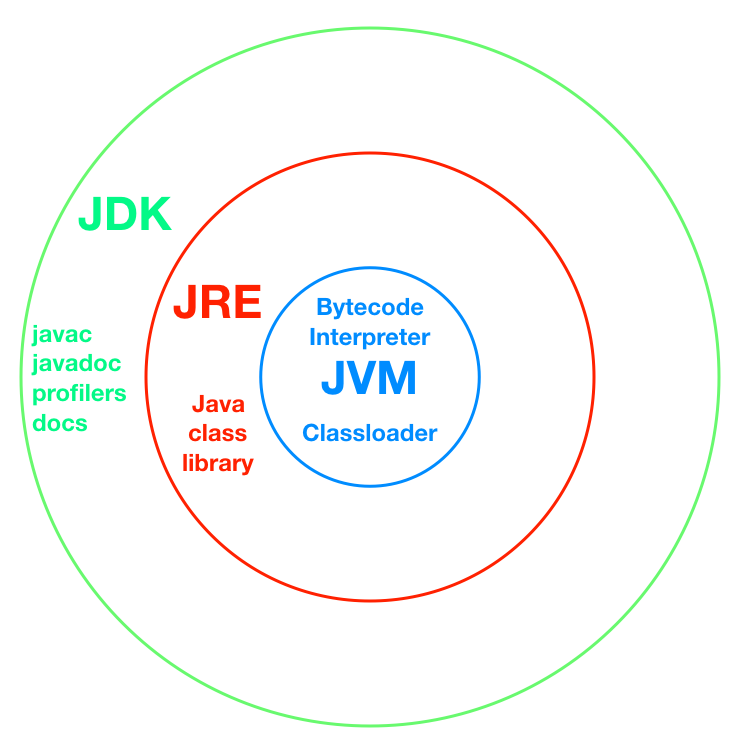

Understanding the internal architecture of Java is an absolute non-negotiable for top-tier companies. They want to know if you actually understand what happens behind the scenes when you hit "run," or if you just memorized the syntax. 

Here is the complete Java execution process, formatted perfectly for an interview setting:

### 1. The Core Architecture: JDK vs. JRE vs. JVM
Interviewers will often ask you to differentiate these three concepts. Here is the exact mental model and formula you should use:

* **JDK (Java Development Kit):** This is the ultimate toolkit for *developers*. It contains everything you need to write, compile, and debug Java code. It includes the compiler (`javac`), archivers (`jar`), debuggers, and the JRE itself. 
    * **Formula:** `JDK = JRE + Development Tools`
* **JRE (Java Runtime Environment):** This is the environment required purely to *run* a Java application. If a user just wants to play a Java game but not write code, they only need the JRE. It contains the JVM and the core class libraries.
    * **Formula:** `JRE = JVM + Core Libraries`
* **JVM (Java Virtual Machine):** This is the heart of Java. It is a virtual engine that physically executes your code by converting it into machine-level instructions.

### 2. The Execution Flow: From `.java` to Machine Code
When you write a program (e.g., `Test.java`), here is the exact step-by-step lifecycle:

1.  **Writing the Code:** You write human-readable Java code in a file named `Test.java`.
2.  **Compilation (`javac`):** You use the Java compiler command (`javac Test.java`). The compiler checks for syntax errors. If everything is correct, it does not create machine code directly. Instead, it generates a `Test.class` file containing **Bytecode**.
    * *Interview Brownie Point:* Emphasize that Bytecode is the secret to Java being **Platform Independent** (Write Once, Run Anywhere). You can compile this Bytecode on a Windows machine, hand the `.class` file to a friend on a Mac, and it will run perfectly.
3.  **Execution (`java`):** You use the command `java Test` to tell the JVM to execute the Bytecode. *(Note: You never add the `.class` extension when running this command; the JVM automatically looks for the class file).*
4.  **Machine Code Translation:** The JVM reads the platform-independent Bytecode and converts it into platform-dependent Machine Code (0s and 1s) that your specific CPU hardware can understand and execute.

### 3. The Interview Differentiator: How the JVM *Actually* Works
If a FAANG or startup interviewer pushes you on *how* the JVM executes the code, don't just say "it reads it line by line." Give them the advanced breakdown:

* **The Interpreter:** The JVM relies on an interpreter to read the Bytecode line by line and execute it. It usually does a quick first pass to parse and group instructions, and a second pass to actually execute them. However, interpreting code line-by-line is relatively slow.
* **The Star Player: JIT (Just-In-Time) Compiler:** To fix the speed issue, the JVM uses the JIT compiler. As your program runs, the JVM acts as a monitor. If it notices a "hot" block of code—like a specific method or a loop being executed repeatedly—the JIT compiler steps in. It pre-compiles that heavily used Bytecode directly into native machine code and caches it. 
* **The Result:** The next time that specific method is called, the JVM skips the slow interpreter and instantly uses the ultra-fast, pre-compiled machine code. This makes Java significantly faster over time as the program runs.





Skeleton of JAVA program and main

### 1. The Java Program Skeleton
Every standalone Java application must have at least one class and a `main` method. 

```java
// 1. Package Declaration (Optional but recommended)
package com.interviewprep.core;

// 2. Import Statements (Bringing in external classes)
import java.util.Scanner;

// 3. Class Declaration
public class SkeletonDemo {

    // Class-level variables (State)
    static int counter = 0;

    // 4. The Main Method (The Entry Point)
    public static void main(String[] args) {
        // Method body (Behavior)
        System.out.println("JVM has successfully entered the main method!");
    }
    
    // Custom methods
    public void helperMethod() {
        // Do something
    }
}
```

---

### 2. The Anatomy of `main` (Word-by-Word Breakdown)
If an interviewer asks, "Explain `public static void main(String[] args)`," they want you to justify every single keyword. Here is exactly what you should say:


* **`public` (Access Modifier):** The `main` method must be `public` because it is called by the JVM (Java Virtual Machine), which is an entirely external program. If it were `private`, `protected`, or `default`, the JVM wouldn't have permission to see or execute it, resulting in a `NoSuchMethodError`.
* **`static` (Keyword):** This is the most important part. The JVM needs to call the `main` method to start the program. If `main` wasn't static, the JVM would have to create an object of your class first. But wait—how would it know *how* to construct your object (e.g., what parameters to pass to the constructor)? To avoid this chicken-and-egg problem, `main` is made `static` so the JVM can invoke it directly at the class level without instantiating an object (`SkeletonDemo.main()`).
* **`void` (Return Type):** The `main` method doesn't return any value to the caller (the JVM). When the `main` method finishes executing, the Java program simply terminates. Returning a value to the JVM serves no purpose.
* **`main` (Method Name):** It's not a keyword; it's simply the identifier that the JVM is hardcoded to look for when launching an application.
* **`String[] args` (Parameters):** This is an array of strings that stores command-line arguments. Why an array of Strings? Because anything you type in the console (numbers, text, symbols) can be safely read and represented as a string. You can parse them into integers or other types later if needed.

---

### 3. The "Gotcha" Interview Questions
Interviewers love to twist the `main` method to see if you crack. Be ready for these:

**Q1: Can we overload the `main` method?**
* **Answer:** Yes, absolutely. You can write `public static void main(int a)` or `public static void main(String arg)`. However, the JVM will **only** look for the exact signature `public static void main(String[] args)` to start the program. The overloaded methods will just act like normal static methods that you must call yourself.

**Q2: Can we override the `main` method?**
* **Answer:** No. Method overriding relies on dynamic (run-time) polymorphism, which requires object instances. Since `main` is a `static` method, it belongs to the class, not the object. If you write a `main` method in a subclass, it's called **Method Hiding**, not overriding.

**Q3: Is `public static void main(String... args)` valid?**
* **Answer:** Yes! This uses **Varargs** (Variable-Length Arguments) introduced in Java 5. Under the hood, the JVM treats `String...` exactly the same as `String[]`, so it compiles and runs perfectly. This is a great flex to show the interviewer.

**Q4: Can the order of modifiers change?**
* **Answer:** Yes. `static public void main(String[] args)` is perfectly valid. The access modifier and non-access modifier can be swapped. (Though `void` must always immediately precede the method name).

**Q5: Can you execute a Java program without a `main` method?**
* **Answer:** *Historically*, yes. In Java 6 and below, you could put your code inside a `static { }` block, and the JVM would run it during class loading before checking for `main`. However, from **Java 7 onwards**, this loophole was closed. The JVM now strictly checks for the presence of the `main` method before doing anything else. Without it, you get a fatal error.

**Would you like to move into how objects created inside the `main` method are handled in memory (Stack vs. Heap), or would you prefer to look at constructors next?**


In Java, every variable must have a declared type before it can be used. This makes Java a **Strongly Typed** language. For interviews, understanding the sizes of these data types and how they interact with each other (Type Casting) is crucial for predicting output snippets and understanding memory constraints.

Here is the deep dive into Primitive Data Types and Type Casting, structured for a senior-level technical discussion.

---

### Part 1: The Memory Hierarchy (The 8 Primitives)
Instead of memorizing exact ranges, memorize their sizes in bytes. One byte = 8 bits. The JVM allocates memory strictly based on these sizes.


**1. Integer Types (Whole Numbers)**
* **`byte` (1 byte / 8 bits):** The smallest. Useful for saving memory in large arrays or working with raw binary data/file streams.
* **`short` (2 bytes / 16 bits):** Rarely used unless specifically optimizing memory for 16-bit systems.
* **`int` (4 bytes / 32 bits):** The **default** type for whole numbers. If you write `x = 10`, Java assumes 10 is an `int`.
* **`long` (8 bytes / 64 bits):** Used for massive numbers (like timestamps, database IDs, or population counts). 
    * *Syntax Rule:* You must append an `L` or `l` at the end (e.g., `long id = 10000000000L;`). If you omit the `L`, Java tries to parse it as a 32-bit `int` first, and if the number is too big, it will throw an "Integer number too large" compilation error.

**2. Floating-Point Types (Decimals)**
* **`float` (4 bytes / 32 bits):** Single-precision decimal. 
    * *Syntax Rule:* You must append an `f` or `F` (e.g., `float pi = 3.14f;`). Why? Because Java assumes *all* decimal numbers are `double` by default.
* **`double` (8 bytes / 64 bits):** The **default** type for decimals. Double-precision. Use this when you need highly accurate mathematical calculations (though for actual currency, always use `BigDecimal`, not primitives).

**3. Character Type**
* **`char` (2 bytes / 16 bits):** Stores a single 16-bit Unicode character enclosed in single quotes (`'A'`). Unlike C/C++ (where `char` is 1 byte/ASCII), Java uses 2 bytes to support international characters (like Hindi, Mandarin, or emojis).

**4. Boolean Type**
* **`boolean` (Size is JVM dependent, usually 1 bit):** Can only be `true` or `false`. It cannot be cast to or from any other data type in Java (unlike C++ where 0 is false and 1 is true).

---

### Part 2: Type Casting (The "Water Bucket" Analogy)
Type casting is converting a variable from one data type to another. Think of data types as buckets of water. `byte` is a tiny teacup, `int` is a mug, and `double` is a large bucket.

#### 1. Widening Casting (Implicit / Automatic Casting)
Converting a **smaller type to a larger type**. 
Java does this automatically because there is absolutely no risk of data loss. You are pouring a teacup of water into a large bucket; it fits perfectly.

* **The Widening Hierarchy:** `byte` -> `short` -> `char` -> `int` -> `long` -> `float` -> `double`

```java
int myInt = 100;           // 4 bytes
long myLong = myInt;       // 8 bytes (Automatic Widening)
double myDouble = myLong;  // 8 bytes (Automatic Widening)

System.out.println(myInt);    // Output: 100
System.out.println(myDouble); // Output: 100.0 (Decimals added safely)
```

**⚠️ The Interview Trick Question:** *Can you implicitly cast a `long` (8 bytes) to a `float` (4 bytes)?*
* **Answer:** YES! Even though `float` uses less memory, its *range* is astronomically higher than a `long` because `float` stores numbers using scientific notation (IEEE 754 standard). You might lose some lower-level precision (exactness), but the overall magnitude of the number fits, so Java considers it a Widening cast and does it automatically.

#### 2. Narrowing Casting (Explicit / Manual Casting)
Converting a **larger type to a smaller type**. 
Java will **not** do this automatically. If you try to pour a large bucket of water into a teacup, water will spill. Java throws a compilation error to protect you from accidental data loss. To force it, you must explicitly write the target data type in parentheses. 

```java
double myDouble = 9.78;
// int myInt = myDouble;   // ERROR: Incompatible types, possible lossy conversion

// Explicitly telling Java: "I accept the data loss."
int myInt = (int) myDouble; 

System.out.println(myDouble); // Output: 9.78
System.out.println(myInt);    // Output: 9 (The .78 is entirely chopped off, NOT rounded)
```

**What happens at the memory level during Narrowing?**
If you cast a massive `long` into an `int`, the JVM literally chops off the top 32 bits of memory. 
```java
long bigNumber = 2147483648L; // One number higher than the max 'int' limit
int truncatedNumber = (int) bigNumber; 

System.out.println(truncatedNumber); // Output: -2147483648
```
*Why did it become negative?* Because the JVM chopped off the top bits, and the new leading bit for the 32-bit integer happened to be a `1`. In binary, a leading `1` signifies a negative number (Two's Complement).

---

### Part 3: The `char` and `int` Relationship
Under the hood, Java characters are just numbers (Unicode values). Because of this, you can cast between `char` and `int` effortlessly.

```java
// Widening: char (2 bytes) to int (4 bytes)
char letter = 'A';
int asciiValue = letter;      // Automatic widening
System.out.println(asciiValue); // Output: 65

// Narrowing: int (4 bytes) to char (2 bytes)
int number = 97;
char lowerCase = (char) number; // Explicit narrowing required
System.out.println(lowerCase);  // Output: 'a'
```

### Summary of FAANG Expectations on this Topic:
1.  **Never memorize exact limits:** Know `Integer.MAX_VALUE` instead of `2147483647`.
2.  **Know the defaults:** Whole numbers are `int`, decimals are `double`. 
3.  **Understand Truncation:** Casting a float to an int *truncates* (removes the decimal); it does *not* round mathematically. `(int) 4.99` becomes `4`.

Excellent choice. Combining these two topics bridges the gap between basic syntax and actual system architecture. Interviewers at companies like Amazon or Swiggy use these concepts to test if you write code that is memory-efficient and bug-free.

Here is the deep dive into Stack vs. Heap memory and Wrapper Classes, including the exact trick questions they will ask you.

---

## Part 1: Memory Management (Stack vs. Heap)
The JVM divides memory into several regions, but for an OOPS interview, you only need to master two: the **Stack** and the **Heap**.


### 1. The Stack (The "Execution" Memory)
Think of the Stack as the active workspace for a thread. Every time a method is called, a new "Stack Frame" is created.
* **What it stores:** * **Local primitive variables:** (e.g., an `int` or `double` declared inside a method).
    * **Reference variables:** (e.g., the *remote control* pointing to an object, not the object itself).
* **Characteristics:** It is extremely fast, thread-safe (each thread has its own stack), and memory is automatically cleared the moment the method finishes execution (LIFO - Last In, First Out).

### 2. The Heap (The "Storage" Memory)
Think of the Heap as a massive warehouse where all the heavy items are kept.
* **What it stores:** * **All Objects:** Anything created with the `new` keyword.
    * **Instance variables:** Even if an instance variable is a primitive (like an `int` inside a `Student` class), it lives on the Heap *inside* its parent object.
* **Characteristics:** It is slower than the stack, shared across all threads (which is why thread-safety is an issue), and is managed by the **Garbage Collector**.

### The Interview Dry-Run
Interviewers will often give you a snippet and ask: *"Draw the memory allocation for this."*

```java
public class MemoryDemo {
    int instanceScore = 90; // Primitive, but it's an instance variable!

    public static void main(String[] args) {
        int localScore = 100;                   // Line 1
        MemoryDemo demoObj = new MemoryDemo();  // Line 2
    }
}
```
**How to explain it like a Senior Dev:**
1.  **Line 1:** `localScore` is a primitive created inside a method. It is placed directly on the **Stack**.
2.  **Line 2:** The `new MemoryDemo()` command creates the actual object in the **Heap**. The primitive `instanceScore` (90) is stored *inside* this object on the Heap. The reference variable `demoObj` is placed on the **Stack**, holding the memory address (like `0x7FF`) pointing to the object in the Heap.

---

## Part 2: Wrapper Classes & Autoboxing
If primitives are so fast and memory-efficient, why did Java introduce classes like `Integer`, `Double`, and `Character`?

### 1. The "Why"
Java’s **Collections Framework** (like `ArrayList`, `HashMap`) can **only** store Objects. You cannot put a primitive `int` into an `ArrayList`. 
Wrapper classes literally "wrap" a primitive value inside a fully-fledged Object so it can be stored on the Heap and used in Collections.

* `int` -> `Integer`
* `char` -> `Character`
* `double` -> `Double`

### 2. Autoboxing and Unboxing (Compiler Magic)
In the old days of Java, converting back and forth was a pain. Now, the compiler does it automatically.

* **Autoboxing:** Automatic conversion of a primitive to its Wrapper Object.
    ```java
    ArrayList<Integer> list = new ArrayList<>();
    list.add(10); // Autoboxing! The compiler secretly changes this to Integer.valueOf(10);
    ```
* **Unboxing:** Automatic conversion of a Wrapper Object back to a primitive.
    ```java
    Integer myObj = new Integer(50); // Deprecated way, but for example
    int myPrim = myObj; // Unboxing! The compiler secretly calls myObj.intValue();
    ```

---

## 🛑 The Ultimate FAANG Trick Question: The Integer Cache
If you only take one thing away from this lesson, make it this. An interviewer will write this code on the board and ask for the output:

```java
Integer a = 127;
Integer b = 127;
System.out.println(a == b); 

Integer c = 128;
Integer d = 128;
System.out.println(c == d); 
```

**The Output:**
* `true`
* `false`

**The "Why" (How to blow the interviewer away):**
When you use the `==` operator on Objects, it checks if they point to the *exact same memory location in the Heap*, not if their values match. 

To save memory, Java maintains an internal **Integer Cache** (a pool of pre-created `Integer` objects) for values ranging from **-128 to 127**. 
* When you say `Integer a = 127`, Java pulls the `127` object from the cache. `b` points to that exact same cached object. Therefore, `a == b` is `true`.
* However, `128` is outside the cache range. Java is forced to create a brand new `Integer` object on the Heap for `c`, and another brand new object for `d`. Since they are two different objects at two different memory addresses, `c == d` is `false`.

*(Note: To compare the actual values of Wrapper objects safely, you must always use `.equals()`, not `==`!)*

