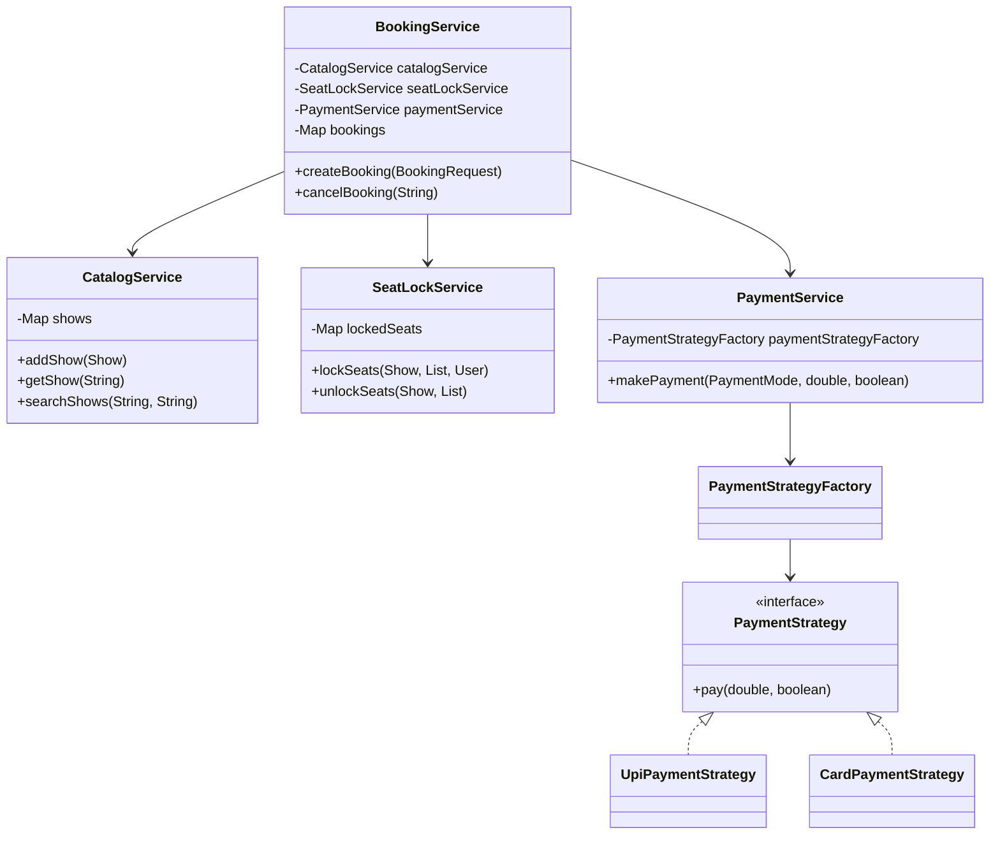

# BookMyShow LLD: Minimal 1-Hour Interview Version

This project is intentionally small. It is not production BookMyShow. It is a version you can realistically code in an SDE-1 LLD interview.

## Coding Order To Remember

Use this same order for other LLD questions:

1. Enums
2. Models
3. Request class
4. Interface
5. Implementations
6. Factory
7. Services
8. Main demo

## What This Project Supports

- Create city, theatre, screen, seats, movie, show objects.
- Search shows by city and movie.
- Book seats.
- Lock seats before payment.
- Pay using UPI or card.
- Confirm booking on payment success.
- Fail booking and unlock seats on payment failure.
- Cancel confirmed booking.

## What Is Skipped

- Spring Boot
- Database
- Repository layer
- Real payment gateway
- Refunds
- Login/auth
- Redis/distributed locks
- Heavy validation

The goal is core LLD flow, not production completeness.

## Simple Folder Structure

```text
src/
  Main.java
  enums/
  model/
  payment/
  service/
```

## Minimal Services

Only four services:

- `CatalogService`: stores shows and searches shows
- `SeatLockService`: locks/unlocks seats temporarily
- `PaymentService`: uses payment strategy
- `BookingService`: main booking and cancellation flow

`CatalogService` does not separately store cities, theatres, and movies. For this interview version, `Show` already has `Movie`, `Theatre`, `Screen`, and `City` through its object references.

## Core Model Idea

Easy entities:

- `User`
- `City`
- `Theatre`
- `Screen`
- `Seat`
- `Movie`
- `Show`

Connecting/transaction entity:

- `Booking`

Rule to remember:

```text
If the system creates a real-world record, make it a class.
```

For BookMyShow:

```text
Booking = User + Show + Seats + Amount + Status
```

## Class Diagram



## Booking Flow

`BookingService.createBooking()` is the most important method.

Flow:

1. Get user and show.
2. Convert seat ids to seat objects.
3. Try to lock seats.
4. Calculate amount.
5. Create booking.
6. Make payment.
7. If payment succeeds:
   - mark booking confirmed
   - mark seats booked
   - unlock seats
8. If payment fails:
   - mark booking failed
   - unlock seats
9. Save booking in map.
10. Return booking.

## Seat Locking

`SeatLockService` is now very small.

It keeps:

```java
Map<String, String> lockedSeats;
```

Key:

```text
showId_seatId
```

Example:

```text
show1_seat1 -> user1
```

For an interview, this is enough. In production, you would discuss Redis/DB locks later.

## Payment Pattern

Payment uses Strategy + Factory:

- `PaymentStrategy`
- `UpiPaymentStrategy`
- `CardPaymentStrategy`
- `PaymentStrategyFactory`

This is enough to show that different payment modes can have different implementations.

## How To Run

```powershell
cd C:\Users\BIT\Documents\Super_Coding\LLD\bookmyshow-lld
javac -d out src\Main.java src\model\*.java src\enums\*.java src\service\*.java src\payment\*.java
java -cp out Main
```

## Sample Output

```text
Searching shows in Bengaluru for Interstellar
show1 | Interstellar | PVR Orion | Audi 1 | 18 May 2026 07:30 PM

Successful booking flow
Booking confirmed: booking1
Booking Id: booking1
Status: CONFIRMED
Payment: SUCCESS
Amount: 500.0
Seats: A1, A2

Payment failure flow
Booking Id: booking2
Status: FAILED
Payment: FAILED
Amount: 250.0
Seats: A3

Cancellation flow
Booking cancelled: booking1
Booking Id: booking1
Status: CANCELLED
Payment: SUCCESS
Amount: 500.0
Seats: A1, A2

Booking seat again after cancellation
Booking confirmed: booking3
Booking Id: booking3
Status: CONFIRMED
Payment: SUCCESS
Amount: 250.0
Seats: A1
```

## Interview Script

Say this:

> I will code the core flow, not the production system. I will create simple models, a Booking transaction class, payment strategy/factory, a small seat lock service, and BookingService as the main orchestrator.

Then:

> The key class is Booking because it connects User, Show, Seats, Amount, and Status.

Then:

> The key service is BookingService because it locks seats, calls payment, confirms or fails the booking, and updates seat state.

## Best Reading Order

1. `BookingRequest`
2. `Booking`
3. `SeatLockService`
4. `PaymentService`
5. `BookingService`
6. `Main`
