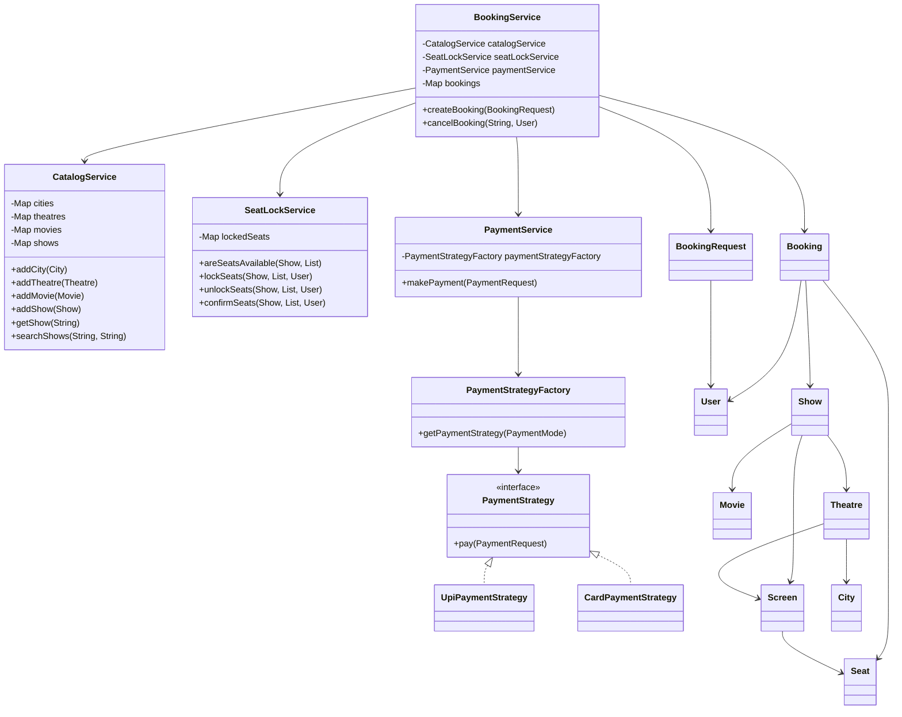

# BookMyShow LLD in Java: 1-Hour Interview Version

This is a simplified BookMyShow Low Level Design project for SDE-1 interviews.

The goal is not to build production BookMyShow. The goal is to practice a repeatable UML-to-code pattern that you can write under interview pressure.

## The Repeatable LLD Coding Pattern

Use this order for most LLD problems:

1. Write enums
2. Write simple model classes
3. Write request/input classes
4. Write interfaces for variable behavior
5. Write implementations
6. Write factory if object creation varies
7. Write service classes
8. Write a small main/demo flow

This project follows the same order.

## Problem Statement

Design a simple movie ticket booking system where:

- Admin can add city, theatre, screen, seats, movie, and show.
- User can search shows by city and movie.
- User can book seats for a show.
- Selected seats are temporarily locked before payment.
- Payment can happen through UPI or card.
- On successful payment, booking is confirmed and seats are booked.
- On failed payment, booking fails and seats are unlocked.
- User can cancel a confirmed booking.
- All data is stored in memory.

## Interview Scope

This version is intentionally small.

Implemented:

- In-memory catalog
- Search shows
- Seat locking
- Booking creation
- Payment Strategy + Factory
- Booking cancellation
- Simple demo in `Main.java`

Skipped:

- Spring Boot
- Database
- Repository layer
- Authentication
- Real payment gateway
- Refunds
- Kafka
- Redis
- Distributed locks
- Advanced concurrency code
- Microservices

In a real system, these would matter. In a 1-hour SDE-1 LLD interview, they distract from the core flow.

## Folder Structure

```text
src/
  Main.java
  enums/
  model/
  payment/
  service/
```

This structure is repeatable:

- `enums`: fixed states and types
- `model`: data classes
- `payment`: strategy, implementations, factory
- `service`: business logic
- `Main.java`: demo flow

## Final Service Set

Only four services are used:

- `CatalogService`: stores and searches city, theatre, movie, and show data
- `SeatLockService`: temporarily locks seats before payment
- `PaymentService`: runs payment using strategy/factory
- `BookingService`: main booking and cancellation flow

Earlier, this design could have separate `MovieService`, `TheatreService`, `ShowService`, and `NotificationService`. For interview coding, that creates too many moving pieces. `CatalogService` intentionally combines catalog operations so you can finish in time.

## Core Classes

Models:

- `User`
- `City`
- `Theatre`
- `Screen`
- `Seat`
- `Movie`
- `Show`
- `Booking`
- `BookingRequest`
- `PaymentRequest`

Enums:

- `SeatStatus`
- `BookingStatus`
- `PaymentStatus`
- `PaymentMode`

Payment:

- `PaymentStrategy`
- `UpiPaymentStrategy`
- `CardPaymentStrategy`
- `PaymentStrategyFactory`

Services:

- `CatalogService`
- `SeatLockService`
- `PaymentService`
- `BookingService`

## Class Diagram



## UML to Java Mapping

| UML item | Java code |
|---|---|
| Class | `class User` |
| Interface | `interface PaymentStrategy` |
| Enum | `enum BookingStatus` |
| A uses B | `private B b;` |
| A has many B | `List<B>` |
| Service stores data | `Map<String, Object>` |
| Interface implementation | `implements PaymentStrategy` |

Example:

```text
BookingService --> PaymentService
```

becomes:

```java
private PaymentService paymentService;
```

## Booking Flow

`BookingService.createBooking(BookingRequest request)` is the most important method.

It follows this interview-friendly service order:

1. Validate input
2. Fetch required object
3. Check business rule
4. Call another service
5. Update entity state
6. Save/update in memory
7. Return result

Actual flow:

1. Validate `BookingRequest`.
2. Fetch `Show` from `CatalogService`.
3. Convert seat ids into `Seat` objects.
4. Check if seats are available.
5. Lock seats using `SeatLockService`.
6. Calculate amount.
7. Create `Booking` with `CREATED` status.
8. Create `PaymentRequest`.
9. Call `PaymentService`.
10. If payment succeeds:
    - mark booking `CONFIRMED`
    - mark seats `BOOKED`
    - remove locks
11. If payment fails:
    - mark booking `FAILED`
    - unlock seats
12. Store booking in map.
13. Return booking.

## Why SeatLockService Matters

Seat locking is the main BookMyShow LLD concept.

Without locking:

- User A selects seat A1.
- User B selects seat A1.
- Both try to pay.
- Same seat can be double-booked.

This project keeps a simple map:

```text
Map<String, String> lockedSeats
key = showId + "_" + seatId
value = userId
```

Example:

```text
show1_seat1 -> user1
```

For production, this would need DB transactions, Redis locks, expiry time, and distributed locking. For an SDE-1 interview, the in-memory map is enough to show the idea.

## Why Payment Uses Strategy + Factory

Payment mode can vary:

- UPI
- Card

So we use:

- `PaymentStrategy`: common interface
- `UpiPaymentStrategy`: UPI payment
- `CardPaymentStrategy`: card payment
- `PaymentStrategyFactory`: returns the right strategy

This keeps `PaymentService` small and easy to explain.

## How to Run

From PowerShell:

```powershell
cd C:\Users\BIT\Documents\Super_Coding\LLD\bookmyshow-lld
javac -d out src\Main.java src\model\*.java src\enums\*.java src\service\*.java src\payment\*.java
java -cp out Main
```

## Sample Output

```text
Searching shows in Bengaluru for Interstellar
show1 | Interstellar | PVR Orion | Audi 1 | 18 May 2026 07:30 PM

Successful booking flow
Booking confirmed: booking1
Booking Id: booking1
Status: CONFIRMED
Payment: SUCCESS
Amount: 500.0
Seats: A1, A2

Payment failure flow
Booking Id: booking2
Status: FAILED
Payment: FAILED
Amount: 250.0
Seats: A3

Cancellation flow
Booking cancelled: booking1
Booking Id: booking1
Status: CANCELLED
Payment: SUCCESS
Amount: 500.0
Seats: A1, A2

Booking seat again after cancellation
Booking confirmed: booking3
Booking Id: booking3
Status: CONFIRMED
Payment: SUCCESS
Amount: 250.0
Seats: A1
```

## Interview Explanation Script

Say this:

> I will code the core flow instead of the entire production system. I will first define enums, then simple models, then request classes, then payment strategy and factory, then services, and finally a main demo.

Then explain the design:

> I kept four services. CatalogService stores city, theatre, movie, and show data in memory. SeatLockService handles temporary seat locking. PaymentService handles payment using Strategy and Factory. BookingService is the main orchestrator.

Then explain booking:

> In createBooking, I validate the request, fetch the show, get selected seats, check availability, lock seats, calculate amount, create payment request, call payment service, and then either confirm the booking and mark seats booked or fail the booking and unlock seats.

Then explain tradeoff:

> In production, catalog operations may be split into MovieService, TheatreService, and ShowService. For a 1-hour SDE-1 interview, I am keeping them together in CatalogService to reduce unnecessary code and focus on the core booking flow.

## Possible Follow-up Questions

**Q: Why not separate MovieService, TheatreService, and ShowService?**

A: We can in production. For interview coding, one `CatalogService` is easier and still clean because all those operations are simple catalog operations.

**Q: Why is BookingService the most important service?**

A: It coordinates the real business flow: validation, show lookup, seat locking, payment, booking state update, seat state update, and storage.

**Q: Why do we need BookingRequest?**

A: It keeps `createBooking()` clean. Instead of passing many parameters, we pass one request object.

**Q: Why not mark seats booked before payment?**

A: Payment may fail. Locking is temporary; booking is permanent only after payment success.

**Q: How would this change in production?**

A: Add DB tables, transactions, lock expiry, distributed locking, real payment gateway, refund flow, authentication, and monitoring.

## Best Reading Order

1. `src/enums`
2. `src/model`
3. `src/model/BookingRequest.java`
4. `src/payment/PaymentStrategy.java`
5. `src/payment/PaymentStrategyFactory.java`
6. `src/service/CatalogService.java`
7. `src/service/SeatLockService.java`
8. `src/service/PaymentService.java`
9. `src/service/BookingService.java`
10. `src/Main.java`

If you are short on time, read only `BookingRequest`, `SeatLockService`, `PaymentService`, `BookingService`, and `Main`.
